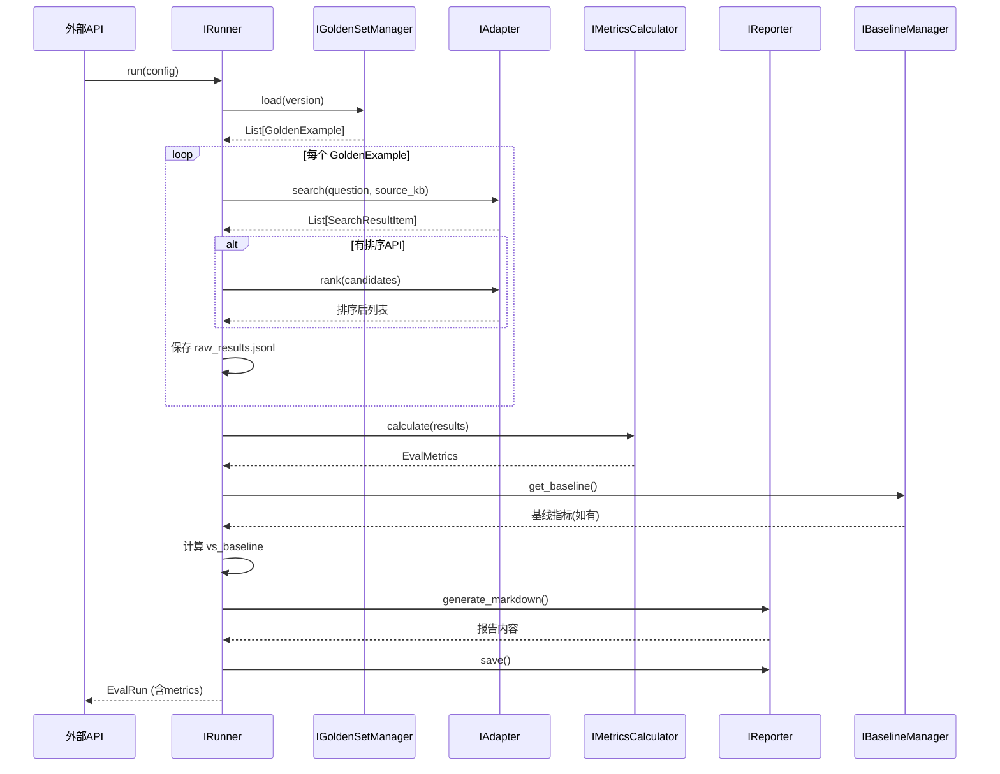
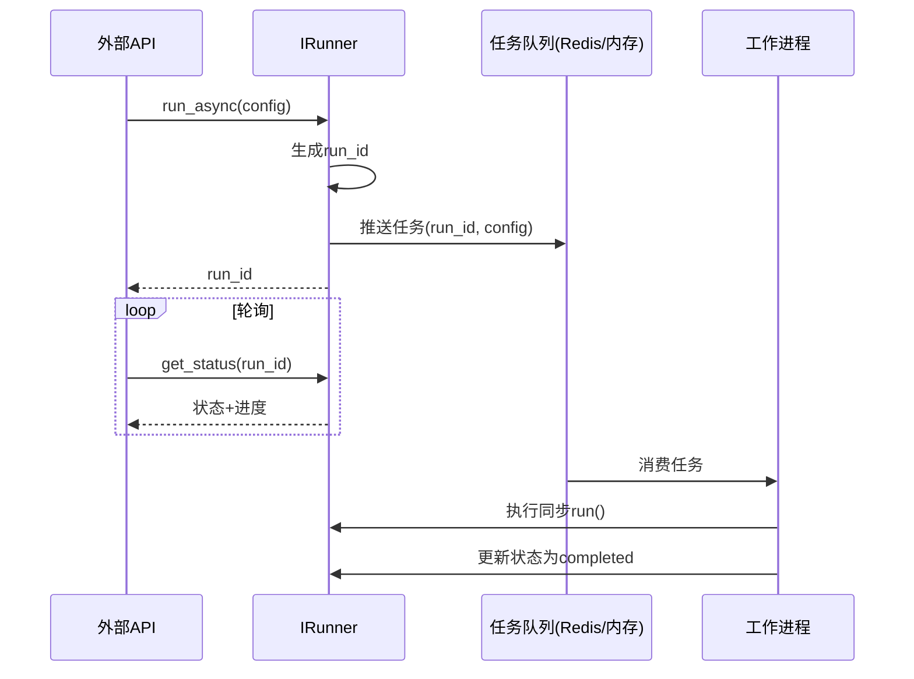

好的，基于已交付的外部API接口设计，现在进入**任务10召回测评的内部接口设计**。内部接口定义了评测系统各模块之间的契约，用于指导代码实现。

---

# 任务10：召回评测 内部接口设计文档（v1.0）

## 一、概述

### 1.1 设计目标
- 定义评测系统内部各模块之间的**抽象接口**，实现模块解耦。
- 明确每个模块的**输入/输出数据结构**，便于并行开发。
- 支持**可插拔扩展**（如未来增加新的指标、新的数据源、新的报告格式）。
- 与外部API（`/api/v1/evaluation/*`）形成清晰的**分层映射**。

### 1.2 模块全景图

```
┌─────────────────────────────────────────────────────────────────┐
│                      外部 API 层（已交付）                      │
│            POST /api/v1/evaluation/runs 等                     │
└─────────────────────────────┬───────────────────────────────────┘
                              │ 调用
┌─────────────────────────────▼───────────────────────────────────┐
│                     内部接口层（本次设计）                       │
├─────────────────────────────────────────────────────────────────┤
│  ┌───────────────┐  ┌───────────────┐  ┌───────────────────┐  │
│  │ 数据集管理接口  │  │ 运行编排接口   │  │   指标计算接口    │  │
│  │ IGoldenSet     │  │ IRunner       │  │  IMetricsCalc     │  │
│  └───────────────┘  └───────────────┘  └───────────────────┘  │
│  ┌───────────────┐  ┌───────────────┐  ┌───────────────────┐  │
│  │ 报告生成接口   │  │ 基线管理接口   │  │   调用适配器接口   │  │
│  │ IReporter     │  │ IBaselineMgr  │  │  IAdapter         │  │
│  └───────────────┘  └───────────────┘  └───────────────────┘  │
└─────────────────────────────────────────────────────────────────┘
                              │ 依赖
┌─────────────────────────────▼───────────────────────────────────┐
│                        基础设施层                              │
│    文件存储（JSON/YAML）  |  HTTP Client  |  ranx 库          │
└─────────────────────────────────────────────────────────────────┘
```

---

## 二、通用数据结构定义

所有模块共享的数据结构，使用Python `dataclass` / Pydantic 风格定义。

### 2.1 黄金问答对（GoldenExample）

```python
@dataclass
class GoldenExample:
    """单条黄金问答对"""
    id: str                          # 唯一标识，如 "credit_001"
    question: str                    # 用户问题
    ground_truth: str                # 标准答案（供人工参考，不参与指标计算）
    expected_chunk_ids: List[str]    # 预期召回的 chunk_id 列表
    expected_doc_ids: List[str]      # 预期召回的 doc_id 列表（冗余，便于调试）
    source_kb: str                   # 所属知识库
    difficulty: Literal["easy", "medium", "hard"]
    question_form: Literal["MATCH", "GAP"]  # MATCH=词汇重叠，GAP=日常改写
    risk_level: Literal["high", "medium", "low"]
```

### 2.2 检索结果（SearchResult）

```python
@dataclass
class SearchResultItem:
    """单条检索结果"""
    chunk_id: str
    doc_id: str
    recall_score: float              # 来自任务6的召回分数
    rank_score: Optional[float] = None  # 来自任务7的排序分数（如有）

@dataclass
class SearchResult:
    """一次查询的完整检索结果"""
    question_id: str
    retrieved_chunks: List[SearchResultItem]  # 按当前排序顺序
    rank_score_used: bool = False             # 是否使用了排序
```

### 2.3 评测配置（EvalConfig）

```python
@dataclass
class EvalConfig:
    """一次评测运行的配置"""
    search_api_url: str                # 任务6接口地址
    rank_api_url: Optional[str] = None # 任务7接口地址（None表示仅评测召回）
    k: int = 10                        # Top-K
    rerank_enabled: bool = False
    source_kbs: Optional[List[str]] = None  # None表示全部
    dataset_version: str = "v1.0"
    concurrency: int = 5               # 并发请求数
    timeout_seconds: int = 30
```

### 2.4 评测指标（EvalMetrics）

```python
@dataclass
class EvalMetrics:
    """单次评测的聚合指标"""
    overall: Dict[str, float]          # {"recall@5": 0.72, "recall@10": 0.86, "mrr": 0.68, "ndcg@10": 0.71}
    by_kb: Dict[str, Dict[str, float]] # {"credit": {"recall@5": 0.80, ...}}
    by_difficulty: Dict[str, Dict[str, float]]  # {"easy": {...}, "medium": {...}}
    by_form: Dict[str, Dict[str, float]]        # {"MATCH": {...}, "GAP": {...}}
    vs_baseline: Optional[Dict[str, float]] = None  # 与基线的差值
    total_queries: int
    failed_queries: int
```

### 2.5 运行记录（EvalRun）

```python
@dataclass
class EvalRun:
    """一次评测运行的完整记录"""
    run_id: str
    name: Optional[str]
    status: Literal["queued", "running", "completed", "failed"]
    config: EvalConfig
    progress: Dict[str, int]           # {"total": 45, "processed": 45, "failed": 0}
    metrics: Optional[EvalMetrics]
    baseline_run_id: Optional[str]
    created_at: datetime
    started_at: Optional[datetime]
    completed_at: Optional[datetime]
    error_message: Optional[str]
```

---

## 三、模块接口定义

### 3.1 数据集管理接口（IGoldenSetManager）

**职责**：管理黄金问答对的加载、查询、版本管理。

```python
class IGoldenSetManager(ABC):
    """黄金问答集管理接口"""

    @abstractmethod
    def load(self, version: Optional[str] = None) -> List[GoldenExample]:
        """
        加载指定版本的黄金问答集。
        :param version: 版本号，如 "v1.0"，默认加载最新
        :return: 黄金问答对列表
        :raises DatasetNotFoundError: 版本不存在
        """
        pass

    @abstractmethod
    def get_info(self, version: Optional[str] = None) -> Dict[str, Any]:
        """
        获取数据集统计信息。
        :return: {"total_records": 45, "by_kb": {...}, "created_at": "...", "updated_at": "..."}
        """
        pass

    @abstractmethod
    def save(self, examples: List[GoldenExample], version: str) -> None:
        """
        保存黄金问答集为新版本。
        :param examples: 问答对列表
        :param version: 新版本号
        :raises DatasetVersionConflictError: 版本已存在
        """
        pass

    @abstractmethod
    def list_versions(self) -> List[str]:
        """列出所有可用版本"""
        pass
```

**实现约束**：
- 底层存储为 `evaluation/datasets/{version}/*.json`。
- 支持按知识库拆分文件（如 `golden_credit.json`）。
- 加载时合并所有知识库文件。

---

### 3.2 检索/排序调用适配器接口（IAdapter）

**职责**：封装对任务6/7接口的调用，屏蔽HTTP细节，统一错误处理。

```python
class IAdapter(ABC):
    """外部服务调用适配器"""

    @abstractmethod
    def search(self, query: str, source_kb: str, config: EvalConfig) -> List[SearchResultItem]:
        """
        调用任务6接口进行检索。
        :param query: 用户问题
        :param source_kb: 知识库标识
        :param config: 评测配置（含API地址、k值、Rerank开关等）
        :return: 检索结果列表（按recall_score降序）
        :raises AdapterError: 网络超时、服务不可用、返回格式异常
        """
        pass

    @abstractmethod
    def rank(self, candidates: List[SearchResultItem], user_context: Dict[str, Any]) -> List[SearchResultItem]:
        """
        调用任务7接口进行排序（可选）。
        :param candidates: 检索候选列表（需含chunk_id和recall_score）
        :param user_context: 用户上下文（如角色）
        :return: 排序后的结果列表
        :raises AdapterError: 服务不可用、返回格式异常
        """
        pass

    @abstractmethod
    def health_check(self, api_url: str) -> bool:
        """
        检查服务是否可用。
        :param api_url: 服务地址
        :return: True表示可用
        """
        pass
```

**实现约束**：
- 内置超时控制（由 `EvalConfig.timeout_seconds` 控制）。
- 自动处理HTTP重试（3次，指数退避）。
- 日志记录每次调用的请求/响应摘要。

---

### 3.3 评测运行编排接口（IRunner）

**职责**：执行完整的评测流水线——遍历黄金问答对，调用适配器，收集结果。

```python
class IRunner(ABC):
    """评测运行编排接口"""

    @abstractmethod
    def run(self, config: EvalConfig, dataset: List[GoldenExample]) -> EvalRun:
        """
        执行一次完整的评测运行（同步/阻塞）。
        :param config: 评测配置
        :param dataset: 黄金问答对列表
        :return: 完整的运行记录（含指标）
        :raises RunnerError: 执行过程中出现不可恢复的错误
        """
        pass

    @abstractmethod
    def run_async(self, config: EvalConfig, dataset: List[GoldenExample]) -> str:
        """
        异步启动评测运行。
        :param config: 评测配置
        :param dataset: 黄金问答对列表
        :return: run_id，用于后续查询
        """
        pass

    @abstractmethod
    def get_status(self, run_id: str) -> EvalRun:
        """
        查询运行状态。
        :param run_id: 运行ID
        :return: 当前运行记录（含进度）
        :raises RunNotFoundError: run_id不存在
        """
        pass

    @abstractmethod
    def cancel(self, run_id: str) -> bool:
        """
        取消运行中的评测。
        :param run_id: 运行ID
        :return: True表示成功取消
        """
        pass

    @abstractmethod
    def list_runs(self, limit: int = 20, offset: int = 0, status: Optional[str] = None) -> List[EvalRun]:
        """
        列出历史运行记录。
        :param limit: 返回条数
        :param offset: 偏移
        :param status: 按状态筛选
        :return: 运行记录列表
        """
        pass
```

**实现约束**：
- 支持并发请求（`EvalConfig.concurrency` 控制）。
- 每个问题的检索结果落盘为 `raw_results.jsonl`（每行一个JSON）。
- 支持断点续跑（通过检查已完成的 `question_id` 列表）。

---

### 3.4 指标计算接口（IMetricsCalculator）

**职责**：基于检索结果和黄金答案，计算各项评测指标。

```python
class IMetricsCalculator(ABC):
    """指标计算接口"""

    @abstractmethod
    def calculate(
        self,
        results: List[Tuple[GoldenExample, SearchResult]],
        k_values: List[int] = [5, 10]
    ) -> EvalMetrics:
        """
        计算所有聚合指标。
        :param results: (黄金问答对, 实际检索结果) 的列表
        :param k_values: 要计算的 K 值列表
        :return: 聚合指标
        """
        pass

    @abstractmethod
    def calculate_single(
        self,
        golden: GoldenExample,
        result: SearchResult,
        k: int = 10
    ) -> Dict[str, float]:
        """
        计算单条结果的指标。
        :param golden: 黄金问答对
        :param result: 实际检索结果
        :param k: Top-K
        :return: {"hit": 1/0, "hit_position": 3, "recall@k": 0.5, ...}
        """
        pass

    @abstractmethod
    def compare_with_baseline(self, metrics: EvalMetrics, baseline: EvalMetrics) -> Dict[str, float]:
        """
        与基线对比，计算差值。
        :param metrics: 当前指标
        :param baseline: 基线指标
        :return: {"recall@5": +0.05, "recall@10": -0.02, ...}
        """
        pass
```

**实现约束**：
- 指标计算使用 `ranx` 库（`Qrels` + `Run`）。
- 支持按知识库、难度、问题形式分组计算。
- 支持自定义 `k_values` 配置。

---

### 3.5 报告生成接口（IReporter）

**职责**：将评测结果生成为可读报告（Markdown / HTML）。

```python
class IReporter(ABC):
    """报告生成接口"""

    @abstractmethod
    def generate_markdown(self, run: EvalRun, dataset_version: str) -> str:
        """
        生成Markdown格式报告。
        :param run: 运行记录（含完整指标）
        :param dataset_version: 黄金集版本
        :return: Markdown字符串
        """
        pass

    @abstractmethod
    def generate_html(self, run: EvalRun, dataset_version: str) -> str:
        """
        生成HTML格式报告（含图表）。
        :param run: 运行记录（含完整指标）
        :param dataset_version: 黄金集版本
        :return: HTML字符串
        """
        pass

    @abstractmethod
    def save(self, content: str, run_id: str, format: Literal["md", "html"]) -> str:
        """
        保存报告到文件。
        :param content: 报告内容
        :param run_id: 运行ID
        :param format: 格式
        :return: 文件路径
        """
        pass
```

**实现约束**：
- Markdown报告包含：运行概览、指标汇总表（总体 + 按知识库分组）、与基线对比、Top-K命中分布图（文本表格形式）。
- HTML报告使用 `plotly` 或 `matplotlib` 生成可视化图表（如Recall@K曲线、各知识库对比柱状图）。

---

### 3.6 基线管理接口（IBaselineManager）

**职责**：管理评测基线（存储、加载、对比）。

```python
class IBaselineManager(ABC):
    """基线管理接口"""

    @abstractmethod
    def set_baseline(self, run_id: str) -> None:
        """
        将某次运行设为当前基线。
        :param run_id: 运行ID
        :raises RunNotFoundError: run_id不存在
        :raises RunNotCompletedError: 运行尚未完成
        """
        pass

    @abstractmethod
    def get_baseline(self) -> Optional[EvalMetrics]:
        """
        获取当前基线的指标。
        :return: 基线指标，若无基线则返回None
        """
        pass

    @abstractmethod
    def get_baseline_run_id(self) -> Optional[str]:
        """获取当前基线的run_id"""
        pass

    @abstractmethod
    def clear_baseline(self) -> None:
        """清除当前基线"""
        pass
```

**实现约束**：
- 底层存储为 `evaluation/baselines/current_baseline.json`（指向某个run_id的软链接+缓存指标快照）。
- 设置基线时自动复制该次运行的 `metrics.json` 到基线目录。

---

## 四、接口调用时序图

### 4.1 同步评测运行流程



### 4.2 异步运行流程（任务队列）



---

## 五、错误码体系（内部模块）

| 错误类型 | 适用模块 | 说明 |
| :--- | :--- | :--- |
| `DatasetNotFoundError` | IGoldenSetManager | 数据集版本不存在 |
| `DatasetVersionConflictError` | IGoldenSetManager | 保存时版本已存在 |
| `AdapterError` | IAdapter | 调用外部服务失败（含子类型：`TimeoutError`, `ServiceUnavailableError`, `ResponseFormatError`） |
| `RunNotFoundError` | IRunner, IBaselineManager | run_id不存在 |
| `RunNotCompletedError` | IBaselineManager | 运行尚未完成，无法设为基线 |
| `RunnerError` | IRunner | 评测执行过程中出现不可恢复错误 |
| `ReportGenerationError` | IReporter | 报告生成失败 |

---

## 六、模块依赖关系

```
┌─────────────────────────────────────────────────────────────────┐
│                      外部API层（已交付）                        │
└─────────────────────────────┬───────────────────────────────────┘
                              │
                              ▼
┌─────────────────────────────────────────────────────────────────┐
│                       IRunner（编排层）                         │
│  ┌──────────────────────────────────────────────────────────┐  │
│  │  依赖: IGoldenSetManager → IAdapter → IMetricsCalculator │  │
│  │       → IReporter → IBaselineManager                    │  │
│  └──────────────────────────────────────────────────────────┘  │
└─────────────────────────────────────────────────────────────────┘
                              │
                              ▼
┌─────────────────────────────────────────────────────────────────┐
│                         基础设施层                             │
│   FileStorage  |  HTTPClient  |  ranx  |  Jinja2/Plotly      │
└─────────────────────────────────────────────────────────────────┘
```

---

## 七、与现有模块的依赖关系

| 内部接口 | 依赖的外部组件 | 说明 |
| :--- | :--- | :--- |
| `IAdapter.search()` | 任务6接口 `POST /api/v1/search` | 需传入 `source_kb` 进行过滤 |
| `IAdapter.rank()` | 任务7接口 `POST /api/v1/rank` | 可选，需传入 `user_context`（默认角色） |
| `IGoldenSetManager` | 文件存储 `evaluation/datasets/` | 读写JSON文件 |
| `IRunner` | 任务队列（可选） | 用于异步执行，可复用现有Celery |
| `IBaselineManager` | 文件存储 `evaluation/baselines/` | 读写基线JSON |

---

## 八、后续扩展点

| 扩展点 | 说明 |
| :--- | :--- |
| **新指标** | `IMetricsCalculator` 可增加 `ContextPrecision`、`ContextRecall` 等Ragas指标 |
| **新报告格式** | `IReporter` 可扩展支持PDF、Excel导出 |
| **新数据源** | `IGoldenSetManager` 可扩展从数据库或对象存储加载 |
| **A/B对比** | `IBaselineManager` 可扩展支持多个基线并存（如 `baseline_v1`、`baseline_v2`） |

---

> 文档版本：v1.0  
> 编写日期：2026-08-09  
> 状态：待评审，可进入实现阶段