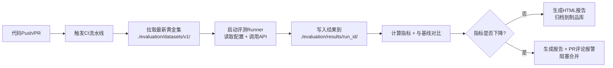

好的，文件存储方式的核心思路是：**把评测相关的所有数据当作“代码资产”和“CI/CD产物”来管理**，完全独立于业务数据库。

我将从**存储内容分类**、**目录结构设计**、**文件格式规范**、**版本管理策略**以及**与流水线的集成方式**五个方面详细介绍。

---

### 一、存储内容分类

文件存储主要管理四类内容：

| 类别 | 内容说明 | 可读性要求 | 变更频率 |
| :--- | :--- | :--- | :--- |
| **1. 黄金问答集（Golden Set）** | 问题、标准答案、预期chunk_id列表、元数据（难度/知识库） | **高**（人工编写/审查） | 中（持续扩充） |
| **2. 评测配置（Config）** | 本次评测的参数（K值、使用的召回/排序接口地址、Rerank开关等） | 中 | 低（每次运行记录） |
| **3. 评测明细结果（Raw Results）** | 每个问题实际召回的chunk_id列表、排名、得分 | 低（机器生成） | 高（每次运行产生） |
| **4. 评测报告（Reports）** | 聚合指标（Recall/MRR/NDCG）、趋势图、与基线对比的Delta | **高**（人类阅读） | 高（每次运行产生） |

---

### 二、推荐的目录结构（放在项目代码仓库根目录下）

```
evaluation/                         # 评测模块根目录
│
├── datasets/                       # 【需人工维护】黄金问答集
│   ├── v1/                         # 数据集版本（Git Tag管理）
│   │   ├── golden_fund.json
│   │   ├── golden_compliance.json
│   │   ├── golden_credit.json
│   │   ├── golden_quant.json
│   │   ├── golden_operations.json
│   │   ├── golden_fi_research.json
│   │   ├── golden_equity.json
│   │   ├── golden_risk.json
│   │   └── golden_ops_front.json
│   ├── v2/                         # 扩充后的新版本
│   │   └── ...
│   └── schema.json                 # JSON Schema校验文件（防格式错误）
│
├── configs/                        # 【自动生成】评测运行配置快照
│   └── 2026-08-07_10-30-45/
│       ├── run_config.yaml         # 本次评测参数（K=10, rerun=false等）
│       └── commit_hash.txt         # 当前代码Git Commit ID
│
├── results/                        # 【自动生成】每次运行的明细结果
│   └── 2026-08-07_10-30-45/
│       ├── raw/                    # 原始检索结果
│       │   ├── recall_details.jsonl  # 每条问题的命中情况（JSON Lines格式）
│       │   └── rank_details.jsonl    # 排序后的明细（可选）
│       ├── metrics/                # 计算后的指标
│       │   └── aggregated_metrics.json  # { "overall": {...}, "by_kb": {...} }
│       └── reports/                # 人类可读的报告
│           ├── report.html         # 可视化报告（含图表）
│           └── report.md           # Markdown格式摘要（供PR评论）
│
├── baselines/                      # 【需人工确认】基线快照
│   ├── baseline_2026-08-01.json    # 锁定某次运行结果作为基准线
│   └── current_baseline.json       # 指向当前生效基线的软链接
│
└── tools/                          # 评测脚本（Python代码）
    ├── runner.py                   # 主执行器
    ├── metrics_calculator.py       # 指标计算（调用ranx）
    ├── report_generator.py         # 报告生成
    └── baseline_manager.py         # 基线管理
```

---

### 三、文件格式规范

#### 1. 黄金问答集（JSON）

```json
{
  "version": "1.0",
  "source_kb": "credit",
  "created_at": "2026-08-07",
  "examples": [
    {
      "id": "credit_001",
      "question": "XX债券的最新信用评级是多少？",
      "ground_truth": "XX债券最新主体评级为AA+，展望稳定。",
      "expected_chunk_ids": ["chunk_abc123", "chunk_def456"],
      "expected_doc_ids": ["doc_789"],
      "difficulty": "easy",
      "question_form": "MATCH",
      "risk_level": "high"
    }
  ]
}
```

> **优点**：人工可读、Git Diff清晰可见、支持JSON Schema校验。

#### 2. 明细结果（JSON Lines, `.jsonl`）

每行一个JSON对象，便于流式读写和大文件处理：

```json
{"question_id": "credit_001", "retrieved_chunk_ids": ["chunk_abc123", "chunk_xyz", "chunk_def456"], "hit_count": 2, "first_hit_pos": 1}
{"question_id": "credit_002", "retrieved_chunk_ids": ["chunk_uuu", "chunk_vvv"], "hit_count": 0, "first_hit_pos": null}
```

#### 3. 聚合指标（JSON）

```json
{
  "run_id": "2026-08-07_10-30-45",
  "commit_hash": "a1b2c3d",
  "config": {"k": 10, "rerank_enabled": false},
  "overall": {"recall@5": 0.72, "recall@10": 0.86, "mrr": 0.68, "ndcg@10": 0.71},
  "by_kb": {
    "credit": {"recall@5": 0.80, "recall@10": 0.90, "mrr": 0.75},
    "fund": {"recall@5": 0.65, "recall@10": 0.82, "mrr": 0.60}
  },
  "vs_baseline": {"recall@5": "+0.05", "recall@10": "+0.02", "mrr": "-0.01"}
}
```

#### 4. 配置文件（YAML）

```yaml
# run_config.yaml
run_id: 2026-08-07_10-30-45
trigger: manual
api_endpoints:
  search: "http://localhost:8080/api/v1/search"
  rank: "http://localhost:8080/api/v1/rank"
parameters:
  k: 10
  rerank_enabled: false
  source_kbs: ["credit", "fund", "equity"]  # 留空表示全部
datasets:
  version: "v1"
  path: "./evaluation/datasets/v1/"
```

---

### 四、版本管理策略

| 内容类型 | 存储位置 | 版本管理方式 |
| :--- | :--- | :--- |
| **黄金问答集** | Git仓库（`evaluation/datasets/`） | Git Tag（v1.0, v1.1），每次扩充打新Tag，方便回溯某次评测用的是哪个版本 |
| **评测配置** | Git仓库 + 运行目录 | 运行目录保留快照，`commit_hash.txt` 记录代码版本 |
| **明细结果 & 报告** | **对象存储（OSS/S3）** 或 **CI/CD制品库（Artifacts）** | 按 `run_id` 组织，不提交Git（避免仓库膨胀） |
| **基线快照** | Git仓库（`evaluation/baselines/`） | 人工确认后提交，作为“黄金基线”永久保留 |

> **关键建议**：明细结果通常很大（几百MB），**不建议提交到Git**。应配置 `.gitignore` 忽略 `results/` 目录，只将 `datasets/`、`baselines/` 和代码提交到仓库。

---

### 五、与CI/CD流水线的集成方式（以GitHub Actions/Jenkins为例）

文件存储方式天然适合CI/CD自动化：



**具体操作**：
1. CI流水线启动时，从Git拉取当前最新的黄金集。
2. 运行评测脚本，调用任务6/7的接口（可以是测试环境地址）。
3. 结果写入 `results/{run_id}/`，然后**上传到CI制品库**（如GitHub Actions的 `actions/upload-artifact`）。
4. 脚本自动读取 `baselines/current_baseline.json` 进行对比。
5. 如果核心指标下降超过阈值（如Recall@5下降>5%），CI任务标记为失败，并在PR中评论警告。

---

### 六、总结：为什么这个方式适合当前项目

| 考量点 | 文件存储方式的优势 |
| :--- | :--- |
| **数据库零改动** | 完全独立，不碰 `数据模型_v6.3`，与任务4-8解耦 |
| **人工友好** | 黄金集用JSON，专家可直接在Git里Review和修改，支持PR评审流程 |
| **版本可追溯** | Git Tag + Commit Hash 完美锁定“当时用了什么数据+什么代码” |
| **与CI天然集成** | 评测作为CI流水线的一步，每次PR自动运行，报告作为附件 |
| **成本低** | 无需申请新表、新字段、新迁移脚本，立即可启动 |
| **扩展性好** | 后续如果要加可视化Dashboard，只需写一个定时任务把 `results/` 下的JSON同步到独立表即可，前期不影响 |

下一步如果确认采用这个方案，我可以帮你：
- 细化 `evaluation/tools/` 下的Python代码骨架（Runner、指标计算器）
- 设计与任务6/7接口调用的具体适配代码
- 编写第一次基线运行的命令脚本