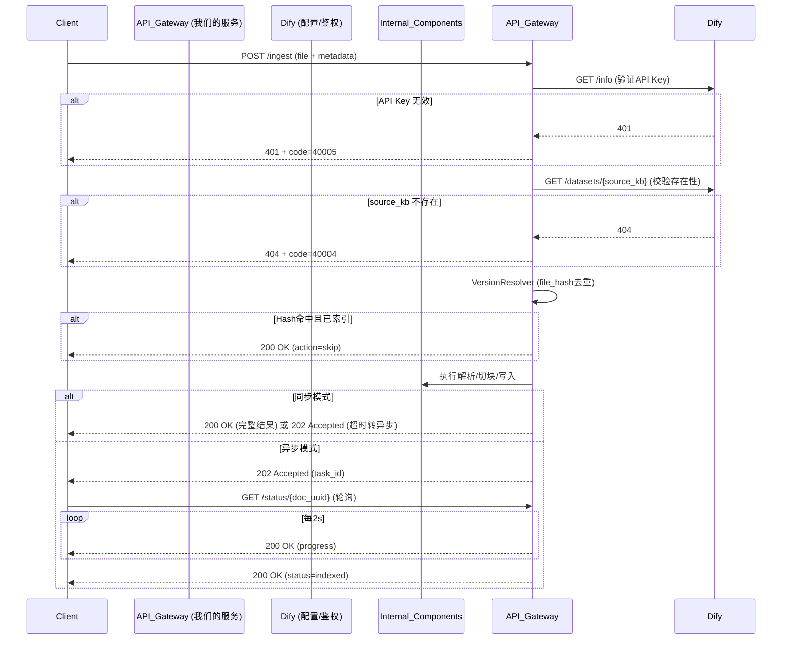

好的。既然要求“深入详细拆解”，我们就不再停留在功能描述层面，而是直接深入到**API契约级别**，涵盖请求/响应结构、字段校验规则、状态码映射、幂等性保障和错误码体系。

这些接口将对外暴露（供前端UI、统一门户、外部系统调用），遵循**RESTful**风格，统一使用**JSON**格式，认证方式为**Bearer Token**（与Dify的Service API Key对齐）。

---

## 一、通用设计原则（贯穿所有接口）

| 维度 | 规范 |
| :--- | :--- |
| **Base URL** | `https://{your-domain}/api/v1/documents` |
| **认证** | `Authorization: Bearer {DIFY_API_KEY}`（透传至Dify `/info`校验租户） |
| **字符编码** | UTF-8 |
| **时间格式** | ISO 8601（如 `2026-08-10T14:32:18Z`） |
| **分页规范** | `page`（从1开始） + `limit`（默认20，最大100） |
| **成功响应体** | `{"code": 0, "data": {...}, "message": "success", "trace_id": "uuid"}` |
| **错误响应体** | `{"code": 40001, "message": "...", "trace_id": "uuid", "details": {...}}`（见文末错误码表） |

---

## 二、核心业务接口详细拆解

### 接口1：触发文档预处理（核心写入入口）

**路径**：`POST /ingest`

**功能**：接收文件流和元数据，触发异步处理管道。支持**同步（阻塞）**和**异步（立即返回task_id）**两种模式。

#### 请求体（`multipart/form-data`）

| 字段名 | 类型 | 必填 | 校验规则 | 描述 |
| :--- | :--- | :--- | :--- | :--- |
| `file` | `binary` | ✅ | 大小 ≤ 50MB；扩展名白名单：`.pdf,.docx,.doc,.xlsx,.pptx,.txt,.md` | 原始文件流 |
| `source_kb` | `string` | ✅ | 长度 ≤ 32；必须匹配Dify中已存在的`dataset_id`（预处理服务会调用`GET /datasets/{id}`校验） | 知识库标识 |
| `doc_type` | `string` | ❌ | 枚举：`report` / `announcement` / `contract` / `research` / `other` | 文档分类，用于后续路由策略 |
| `published_date` | `string` | ❌ | ISO 8601日期（如 `2026-07-01`） | 文档发布日期，用于时间加权排序 |
| `tags` | `string` | ❌ | 逗号分隔，每个Tag ≤ 20字符，最多10个 | 例如 `"新能源,城投债,AAA评级"` |
| `async_mode` | `boolean` | ❌ | 默认 `false` | `true` 表示异步；`false` 表示同步等待完成（最长120s） |

#### 成功响应（异步模式，`async_mode=true`）

**HTTP Status**: `202 Accepted`

```json
{
  "code": 0,
  "data": {
    "doc_uuid": "doc_20260810_a1b2c3d4",
    "task_id": "task_20260810_x9y8z7w6",
    "status": "pending",
    "check_status_url": "/api/v1/documents/status/doc_20260810_a1b2c3d4"
  },
  "message": "Document accepted for processing",
  "trace_id": "trace_abc123"
}
```

#### 成功响应（同步模式，`async_mode=false`）

**HTTP Status**: `200 OK`（处理完成） 或 `202 Accepted`（超时转为异步）

```json
{
  "code": 0,
  "data": {
    "doc_uuid": "doc_20260810_a1b2c3d4",
    "version": "v1.0",
    "action": "new",          // new | skip | retry
    "status": "indexed",      // indexed | failed | processing
    "chunk_count": 156,
    "elapsed_time_sec": 45.3,
    "indexed_at": "2026-08-10T14:33:03Z"
  },
  "message": "Document indexed successfully",
  "trace_id": "trace_abc123"
}
```

#### 特殊场景响应（Hash命中，直接跳过）

**HTTP Status**: `200 OK`

```json
{
  "code": 0,
  "data": {
    "doc_uuid": "doc_existing_123",
    "action": "skip",
    "message": "Duplicate document (same file_hash), skipping"
  },
  "trace_id": "trace_abc123"
}
```

#### 校验失败响应（4xx）

| 场景 | HTTP Status | Code | Message示例 |
| :--- | :--- | :--- | :--- |
| 文件为空 | `400` | `40001` | `"File is empty"` |
| 扩展名不支持 | `400` | `40002` | `"Unsupported file extension: .exe"` |
| 文件超过50MB | `413` | `40003` | `"File size exceeds 50MB limit"` |
| `source_kb`在Dify中不存在 | `404` | `40004` | `"Knowledge base 'fund' not found in Dify"` |
| API Key无效 | `401` | `40005` | `"Invalid or expired API Key"` |

---

### 接口2：查询文档处理状态（进度轮询）

**路径**：`GET /status/{doc_uuid}`

**功能**：返回文档的实时处理进度，供前端轮询（推荐间隔2-3秒）。

#### 请求参数（Path + Query）

| 参数 | 位置 | 必填 | 描述 |
| :--- | :--- | :--- | :--- |
| `doc_uuid` | Path | ✅ | 文档唯一标识 |
| `fields` | Query | ❌ | 可选 `"basic"`（默认） / `"detailed"`（含节点级耗时） |

#### 成功响应（`fields=basic`）

**HTTP Status**: `200 OK`

```json
{
  "code": 0,
  "data": {
    "doc_uuid": "doc_20260810_a1b2c3d4",
    "file_name": "2026年Q2城投债信用展望.pdf",
    "source_kb": "信评知识库",
    "status": "processing",   // pending | processing | indexed | failed
    "progress": 45,           // 0-100 整数，估算百分比
    "current_stage": "chunking",  // parsing | chunking | writing_mysql | writing_es | writing_milvus
    "retry_count": 0,
    "created_at": "2026-08-10T14:32:18Z",
    "processing_started_at": "2026-08-10T14:32:20Z",
    "estimated_time_sec": 30   // 预估剩余秒数（基于历史平均）
  },
  "trace_id": "trace_xyz789"
}
```

#### 成功响应（`fields=detailed`，含节点级耗时）

```json
{
  "code": 0,
  "data": {
    ... (上述基础字段) ...,
    "stages": [
      {"stage": "parsing", "status": "completed", "duration_ms": 3200},
      {"stage": "chunking", "status": "in_progress", "duration_ms": 1200},
      {"stage": "writing_mysql", "status": "pending", "duration_ms": null},
      {"stage": "writing_es", "status": "pending", "duration_ms": null},
      {"stage": "writing_milvus", "status": "pending", "duration_ms": null}
    ],
    "last_error": null
  },
  "trace_id": "trace_xyz789"
}
```

#### 失败状态响应（`status=failed`）

```json
{
  "code": 0,
  "data": {
    "doc_uuid": "doc_20260810_a1b2c3d4",
    "status": "failed",
    "progress": 100,
    "retry_count": 2,
    "last_error": "MinerU parsing timeout after 120s",
    "error_code": "50002",
    "created_at": "2026-08-10T14:32:18Z",
    "indexed_at": null
  },
  "trace_id": "trace_xyz789"
}
```

#### 异常响应

| 场景 | HTTP Status | Code |
| :--- | :--- | :--- |
| `doc_uuid`不存在 | `404` | `40401` |
| `doc_uuid`格式非法（非UUID） | `400` | `40006` |

---

### 接口3：文档列表（统一门户数据源）

**路径**：`GET /`

**功能**：按多维度条件分页查询文档元数据，支撑统一知识库门户的前端展示。

#### 请求参数（Query String）

| 参数 | 类型 | 必填 | 描述 |
| :--- | :--- | :--- | :--- |
| `source_kb` | `string` | ❌ | 精确匹配知识库标识，可多次传入（`source_kb=fund&source_kb=credit`） |
| `status` | `string` | ❌ | 枚举：`pending` / `processing` / `indexed` / `failed` |
| `doc_type` | `string` | ❌ | 枚举：`report` / `announcement` / `contract` / `research` / `other` |
| `keyword` | `string` | ❌ | 模糊搜索 `file_name` 或 `doc_uuid` |
| `tag` | `string` | ❌ | 精确匹配标签（`tags`字段包含该值） |
| `created_after` | `string` | ❌ | ISO 8601，如 `2026-08-01T00:00:00Z` |
| `created_before` | `string` | ❌ | ISO 8601 |
| `page` | `integer` | ❌ | 默认 `1`，最小 `1` |
| `limit` | `integer` | ❌ | 默认 `20`，最大 `100` |
| `sort_by` | `string` | ❌ | 枚举：`created_at` / `updated_at` / `file_name`，默认 `-created_at`（加`-`表示降序） |

#### 成功响应

**HTTP Status**: `200 OK`

```json
{
  "code": 0,
  "data": {
    "items": [
      {
        "doc_uuid": "doc_20260810_a1b2c3d4",
        "file_name": "2026年Q2城投债信用展望.pdf",
        "source_kb": "信评知识库",
        "doc_type": "report",
        "version": "v1.0",
        "status": "indexed",
        "chunk_count": 156,
        "tags": ["城投债", "信用风险"],
        "published_date": "2026-07-15",
        "created_at": "2026-08-10T14:32:18Z",
        "indexed_at": "2026-08-10T14:33:03Z"
      }
      // ... 更多文档
    ],
    "pagination": {
      "page": 1,
      "limit": 20,
      "total": 284,
      "has_more": true
    }
  },
  "trace_id": "trace_uvw456"
}
```

#### 空列表响应

```json
{
  "code": 0,
  "data": {
    "items": [],
    "pagination": {"page": 1, "limit": 20, "total": 0, "has_more": false}
  },
  "trace_id": "trace_uvw456"
}
```

---

### 接口4：文档详情（运维与审计）

**路径**：`GET /{doc_uuid}`

**功能**：返回单篇文档的完整元数据、版本信息和处理日志，供运维人员排查问题。

#### 请求参数

| 参数 | 位置 | 必填 | 描述 |
| :--- | :--- | :--- | :--- |
| `doc_uuid` | Path | ✅ | 文档唯一标识 |
| `include_chunks` | Query | ❌ | `true` 时返回前20个子块预览（默认`false`） |
| `include_errors` | Query | ❌ | `true` 时返回完整错误堆栈（默认`false`） |

#### 成功响应（基础版）

**HTTP Status**: `200 OK`

```json
{
  "code": 0,
  "data": {
    "doc_uuid": "doc_20260810_a1b2c3d4",
    "file_name": "2026年Q2城投债信用展望.pdf",
    "file_hash": "a1b2c3d4e5f6...",
    "file_path": "/信评知识库/doc_20260810_a1b2c3d4/v1.0/原始文件.pdf",
    "source_kb": "信评知识库",
    "doc_type": "report",
    "version": "v1.0",
    "status": "indexed",
    "published_date": "2026-07-15T00:00:00Z",
    "tags": ["城投债", "信用风险"],
    "retry_count": 0,
    "last_error": null,
    "processing_started_at": "2026-08-10T14:32:20Z",
    "indexed_at": "2026-08-10T14:33:03Z",
    "created_at": "2026-08-10T14:32:18Z",
    "updated_at": "2026-08-10T14:33:03Z",
    "statistics": {
      "page_count": 45,
      "word_count": 18200,
      "chunk_count": 156,
      "parent_count": 28,
      "child_count": 128,
      "has_tables": true,
      "has_images": true
    }
  },
  "trace_id": "trace_rst789"
}
```

#### 成功响应（含错误堆栈）

```json
{
  "code": 0,
  "data": {
    ... (基础字段) ...,
    "last_error": "MinerU parsing timeout after 120s",
    "error_stack": "Traceback (most recent call last):\n  File ...",
    "parse_warnings": ["第8页图片无文本层，已标记为image_placeholder"]
  },
  "trace_id": "trace_rst789"
}
```

---

### 接口5：手动重试（运维接口）

**路径**：`POST /retry/{doc_uuid}`

**功能**：将状态为`failed`（`status=2`）的文档重新置为待处理状态，触发补偿任务。**仅管理员角色可调用**（通过API Key对应的Dify账户角色判断）。

#### 请求体（JSON）

| 字段 | 类型 | 必填 | 描述 |
| :--- | :--- | :--- | :--- |
| `force` | `boolean` | ❌ | 默认`false`。`true`时强制重试（即使`status=1`也会重新处理，用于数据修复） |

#### 成功响应

**HTTP Status**: `202 Accepted`

```json
{
  "code": 0,
  "data": {
    "doc_uuid": "doc_20260810_a1b2c3d4",
    "previous_status": "failed",
    "new_status": "pending",
    "retry_count": 3,          // 递增后的值
    "estimated_time_sec": 45
  },
  "message": "Document retry triggered successfully",
  "trace_id": "trace_retry_001"
}
```

#### 异常响应

| 场景 | HTTP Status | Code | Message |
| :--- | :--- | :--- | :--- |
| `doc_uuid`不存在 | `404` | `40401` | `"Document not found"` |
| 文档正在处理中（`status=processing`） | `409` | `40901` | `"Document is already being processed, cannot retry"` |
| 超过最大重试次数（`retry_count>=3`且`force=false`） | `403` | `40301` | `"Max retry attempts (3) exceeded, use force=true to override"` |
| 无权限（调用方角色非`admin`） | `403` | `40302` | `"Insufficient permissions to retry documents"` |

---

## 三、统一错误码体系（核心模块）

| Code | HTTP Status | 类别 | 描述 | 建议客户端行为 |
| :--- | :--- | :--- | :--- | :--- |
| `40001` | `400` | 请求错误 | 文件为空或未上传 | 提示用户重新上传 |
| `40002` | `400` | 请求错误 | 不支持的文件扩展名 | 提示允许的格式列表 |
| `40003` | `413` | 请求错误 | 文件超过大小限制 | 提示文件过大 |
| `40004` | `404` | 资源不存在 | `source_kb`在Dify中不存在 | 检查知识库ID是否正确 |
| `40005` | `401` | 认证失败 | API Key无效或过期 | 重新登录获取新Key |
| `40006` | `400` | 请求错误 | `doc_uuid`格式非法 | 检查UUID格式 |
| `40301` | `403` | 权限不足 | 超过最大重试次数 | 联系管理员或使用`force=true` |
| `40302` | `403` | 权限不足 | 无重试权限 | 仅管理员可重试 |
| `40401` | `404` | 资源不存在 | 文档不存在 | 检查`doc_uuid`是否正确 |
| `40901` | `409` | 资源冲突 | 文档正在处理中 | 等待处理完成后再重试 |
| `50001` | `500` | 服务内部 | MinerU服务不可用 | 自动重试（指数退避），超过3次发告警 |
| `50002` | `500` | 服务内部 | MinerU解析超时（120s） | 同上 |
| `50003` | `500` | 服务内部 | MySQL写入失败 | 重试，若持续失败则发告警 |
| `50004` | `500` | 服务内部 | ES/Milvus写入失败 | 重试，标记`retryable=true`，补偿任务处理 |
| `50005` | `500` | 服务内部 | 对象存储（MinIO）写入失败 | 重试，若持续失败则丢弃本次任务 |

---

## 四、接口调用流程图（含状态码与重试逻辑）



以上接口设计已经足够细化到编码阶段，且完全考虑了**安全性（API Key鉴权）**、**可观测性（trace_id）**、**容错性（状态码分类、重试策略）**和**运维友好性（详细错误堆栈、进度轮询）**。你可以直接将其作为开发团队的接口文档基线。