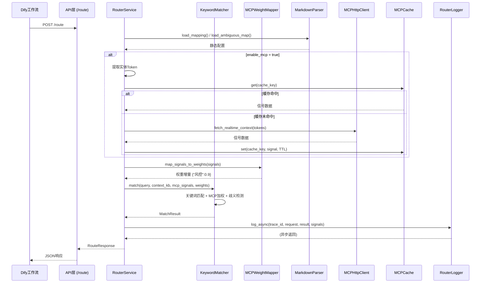
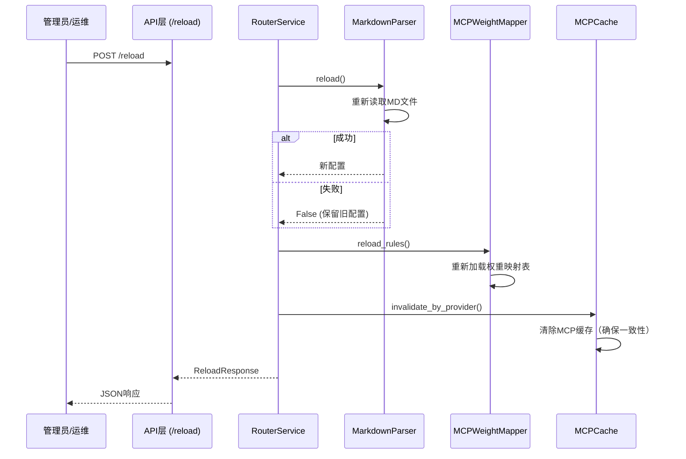

# 全局字典与路由模块 —— 内部接口设计文档


## 一、文档概述

| 项目 | 说明 |
| :--- | :--- |
| **文档版本** | v2.0 |
| **模块名称** | 全局字典与路由模块（Global Router Module） |
| **文档用途** | 定义模块内部各层之间的接口契约，供开发、联调、单元测试使用 |
| **设计原则** | 依赖倒置（DIP）：上层不依赖下层实现，只依赖抽象接口 |
| **涉及语言** | Python 3.12 + ABC（抽象基类）/ Protocol |
| **更新说明** | 本次新增 MCP 动态元数据集成相关接口 |


## 二、架构分层与接口总览

### 2.1 分层架构图

```text
┌─────────────────────────────────────────────────────────────────┐
│                      API 层（对外暴露）                          │
│              FastAPI Router（/route, /reload, /health）         │
└─────────────────────────────────────────────────────────────────┘
                                │
                                ▼
┌─────────────────────────────────────────────────────────────────┐
│                   应用层（服务编排）                             │
│                    RouterService                                │
│        ┌──────────────────────────────────────┐                 │
│        │  编排：Parser → Matcher → Logger     │                 │
│        │  协调：MCP Client → Cache → Mapper   │                 │
│        └──────────────────────────────────────┘                 │
└─────────────────────────────────────────────────────────────────┘
                                │
                                ▼
┌─────────────────────────────────────────────────────────────────┐
│                    领域层（核心业务逻辑）                        │
│      KeywordMatcher（关键词打分、歧义判断、标签提取）             │
│      MCPWeightMapper（信号→权重映射）          │←── MCP 增强    │
└─────────────────────────────────────────────────────────────────┘
                                │
                                ▼
┌─────────────────────────────────────────────────────────────────┐
│                  基础设施层（技术实现）                          │
│  ┌──────────────┬──────────────┬──────────────┬──────────────┐ │
│  │ MarkdownParser│ DifyClient   │ MCPHttpClient│ MySQLCache   │ │
│  │ (配置解析)   │ (平台防腐)   │ (信号拉取)   │ (缓存管理)   │ │
│  └──────────────┴──────────────┴──────────────┴──────────────┘ │
└─────────────────────────────────────────────────────────────────┘
```

### 2.2 内部接口清单

| 序号 | 接口名称 | 所属层级 | 职责 | 实现类 |
| :--- | :--- | :--- | :--- | :--- |
| 1 | `IRouterParser` | 基础设施 | 加载配置源（MD/Nacos） | `MarkdownParser` |
| 2 | `IKBClient` | 基础设施/防腐 | 调用 Dify API 获取知识库列表 | `DifyPlatformClient` |
| 3 | `IMetadataMCPClient` | 基础设施/防腐 | 调用 MCP 服务拉取实时信号 | `MCPHttpClient` |
| 4 | `IMCPCache` | 基础设施 | 缓存 MCP 查询结果 | `MySQLMCPCache` / `RedisMCPCache` |
| 5 | `IRouterMatcher` | 领域 | 核心匹配引擎（含 MCP 增强） | `KeywordMatcher` |
| 6 | `IMCPWeightMapper` | 领域 | 信号→路由权重映射 | `DatabaseWeightMapper` |
| 7 | `IRouterLogger` | 基础设施 | 路由日志写入 | `MysqlRouterLogger` |


## 三、公共数据模型（DTO）

以下数据结构在所有接口中共享，定义于 `app/core/models.py`。

### 3.1 路由请求/响应

```python
from typing import Optional, List, Dict, Any
from pydantic import BaseModel, Field

class RouteRequest(BaseModel):
    """路由请求"""
    user_query: str = Field(..., description="用户输入的问题", max_length=500)
    context_kb: Optional[str] = Field(None, description="用户当前所在知识库")
    enable_mcp: bool = Field(True, description="是否启用MCP动态增强")

class RouteResponse(BaseModel):
    """路由响应"""
    status: str = Field("success", description="固定返回success")
    routed_kbs: List[str] = Field(..., description="推荐的知识库列表（最多3个）")
    confidence: float = Field(..., description="置信度 0~1")
    clarity_flag: str = Field(..., description="clear / ambiguous / unknown")
    suggested_question: Optional[str] = Field(None, description="引导话术")
    filter_tags: List[str] = Field(default_factory=list, description="提取的标签（最多10个）")
    matched_keywords: List[str] = Field(default_factory=list, description="命中的关键词（最多10个）")
    mcp_enhanced: bool = Field(False, description="是否受MCP动态信号干预")
    mcp_hint: Optional[str] = Field(None, description="MCP干预原因说明")
```

### 3.2 匹配结果（内部传递）

```python
from dataclasses import dataclass

@dataclass
class MatchResult:
    """路由匹配结果（领域层返回）"""
    routed_kbs: List[str]
    confidence: float
    clarity_flag: str              # clear / ambiguous / unknown
    suggested_question: Optional[str]
    filter_tags: List[str]
    matched_keywords: List[str]
    mcp_applied: bool              # 本次匹配是否应用了MCP信号
    mcp_hint: Optional[str]        # MCP干预提示
    mcp_details: Dict[str, Any]    # MCP详细数据（用于日志）
```

### 3.3 MCP 相关数据模型

```python
@dataclass
class MCPProviderConfig:
    """MCP 服务提供者配置"""
    id: int
    provider_name: str
    endpoint_url: str
    auth_type: str                 # none / bearer / api_key
    auth_credential: Optional[str]  # 加密存储
    timeout_ms: int
    cache_ttl_seconds: int
    retry_count: int
    is_active: bool
    priority: int

@dataclass
class MCPSignal:
    """MCP 返回的实时信号（标准化后）"""
    provider_name: str
    raw_signals: Dict[str, Any]    # 原始JSON
    normalized_signals: Dict[str, Any]  # 标准化后 {"risk_level": "high"}
    latency_ms: int
    fetched_at: datetime

@dataclass
class WeightDelta:
    """权重增量"""
    target_kb: str
    delta: float                   # 正数加分，负数减分
    reason: str                    # 如 "risk_level=high"

@dataclass
class WeightMappingRule:
    """权重映射规则"""
    id: int
    signal_key: str
    signal_value: str
    target_kb: str
    weight_delta: float
    expire_seconds: int
    operator: str                  # eq / ne / contains / gt / lt
```

### 3.4 路由日志数据模型

```python
@dataclass
class RouterLogEntry:
    """路由日志条目"""
    trace_id: str
    user_query: str
    context_kb: Optional[str]
    routed_kbs: List[str]
    clarity_flag: str
    confidence: float
    matched_keywords: List[str]
    filter_tags: List[str]
    mcp_triggered: bool
    mcp_signals: Optional[Dict[str, Any]]
    mcp_weight_applied: Optional[Dict[str, float]]
    selected_kb: Optional[str]
    is_resolved: int               # 0 / 1
```


## 四、基础设施层接口

### 4.1 `IRouterParser` —— 配置解析器

```python
from abc import ABC, abstractmethod
from typing import Dict, List, Tuple

class IRouterParser(ABC):
    """
    配置解析器接口
    
    职责：从不同数据源（MD文件、Nacos、数据库）加载路由配置
    设计意图：将配置来源与业务逻辑解耦，便于切换存储方式
    """
    
    @abstractmethod
    def load_mapping(self) -> Dict[str, List[Tuple[str, float]]]:
        """
        加载关键词→知识库映射
        
        Returns:
            Dict: {知识库名称: [(关键词, 权重)]}
        
        Example:
            >>> parser.load_mapping()
            {"固收投研": [("债券", 1.0), ("利差", 0.6)]}
        """
        pass
    
    @abstractmethod
    def load_ambiguous_map(self) -> List[str]:
        """
        加载歧义词列表
        
        Returns:
            List[str]: 歧义词列表，如 ["风险", "估值"]
        """
        pass
    
    @abstractmethod
    def load_mcp_signal_config(self) -> Dict[str, Any]:
        """
        加载 MCP 信号相关配置（从 Nacos 或数据库）
        
        Returns:
            Dict: {
                "enable_dynamic_routing": true,
                "fallback_on_timeout": "ignore",
                "global_cache_ttl": 120
            }
        """
        pass
    
    @abstractmethod
    def get_version(self) -> str:
        """获取配置版本号"""
        pass
    
    @abstractmethod
    def reload(self) -> bool:
        """重新加载配置，返回是否成功"""
        pass
```

**实现要求**：
- 启动时自动加载一次
- `reload()` 调用后原子性切换配置，不影响正在处理中的请求
- 加载失败时保留旧配置，不抛异常


### 4.2 `IKBClient` —— Dify 平台防腐层

```python
from abc import ABC, abstractmethod
from typing import List

class IKBClient(ABC):
    """
    Dify 平台客户端接口（防腐层）
    
    职责：隔离 Dify API 的变化，保护核心业务逻辑
    设计意图：Dify API 升级时只需修改此实现，领域层不受影响
    """
    
    @abstractmethod
    async def fetch_all_kbs(self) -> List[str]:
        """
        调用 Dify GET /datasets 获取所有知识库名称
        
        Returns:
            List[str]: 知识库名称列表，如 ["固收投研", "基金知识库"]
        
        Raises:
            DifyAPIError: Dify API 调用失败时抛出
        """
        pass
    
    @abstractmethod
    async def fetch_kb_detail(self, kb_name: str) -> Optional[Dict[str, Any]]:
        """
        调用 Dify GET /datasets/{id} 获取知识库详情
        
        Args:
            kb_name: 知识库名称
            
        Returns:
            Dict: {
                "id": "xxx",
                "name": "固收投研",
                "description": "固收投研相关文档",
                "document_count": 120
            }
        """
        pass
    
    @abstractmethod
    async def health_check(self) -> bool:
        """检查 Dify API 是否可访问"""
        pass
```

**降级策略**：
- `fetch_all_kbs` 失败时，使用上次成功缓存的列表（内存缓存）
- 连续失败 3 次后，触发告警但不阻塞路由


### 4.3 `IMetadataMCPClient` —— MCP 元数据客户端

```python
from abc import ABC, abstractmethod
from typing import List, Dict, Any, Optional

class IMetadataMCPClient(ABC):
    """
    MCP 元数据服务客户端接口
    
    职责：拉取实时业务信号（风险评级、监管动态、舆情标签）
    设计意图：支持多个 MCP 服务提供者，实现故障隔离
    """
    
    @abstractmethod
    async def fetch_realtime_context(
        self, 
        tokens: List[str],
        provider_id: Optional[int] = None,
        timeout_ms: Optional[int] = None
    ) -> Dict[str, Any]:
        """
        根据 Token 列表查询实时元数据
        
        Args:
            tokens: 分词后的Token列表，如 ["贵州", "城投债", "XX集团"]
            provider_id: 指定使用的MCP服务提供者ID，None则使用优先级最高的
            timeout_ms: 超时时间（毫秒），覆盖默认配置
            
        Returns:
            Dict: 标准化信号
            Example: {
                "risk_level": "high",
                "regulatory_status": "watchlist",
                "bond_code": "123456",
                "rating_outlook": "negative",
                "alerts": ["评级下调", "列入观察名单"]
            }
            
        Raises:
            MCPTimeoutError: 超时
            MCPUnavailableError: 服务不可用
            MCPAuthError: 鉴权失败
            MCPInvalidResponseError: 返回数据格式无效
        """
        pass
    
    @abstractmethod
    async def fetch_batch_context(
        self,
        token_groups: List[List[str]]
    ) -> List[Dict[str, Any]]:
        """
        批量查询（支持并行调用多个 MCP 服务）
        
        Args:
            token_groups: 多组 Token 列表
            
        Returns:
            List[Dict]: 与输入顺序对应的信号列表
        """
        pass
    
    @abstractmethod
    async def health_check(self, provider_id: Optional[int] = None) -> Dict[str, Any]:
        """
        检查 MCP 服务健康状态
        
        Returns:
            Dict: {
                "provider_name": "RiskMetadataService",
                "status": "healthy",  # healthy / degraded / unhealthy
                "latency_ms": 120,
                "last_success": "2026-08-05T10:00:00Z"
            }
        """
        pass
```

**熔断要求**：
- 连续失败 ≥ `circuit_breaker_threshold`（Nacos配置）时进入熔断状态
- 熔断期间快速返回空信号（不阻塞路由）
- 熔断时间窗口后自动恢复探测


### 4.4 `IMCPCache` —— MCP 缓存接口

```python
from abc import ABC, abstractmethod
from typing import Optional, Dict, Any

class IMCPCache(ABC):
    """
    MCP 查询结果缓存接口
    
    职责：减少对 MCP 服务的重复调用，保证路由响应速度
    设计意图：支持多种缓存后端（MySQL、Redis、内存），可插拔
    """
    
    @abstractmethod
    def get(self, cache_key: str) -> Optional[Dict[str, Any]]:
        """
        获取缓存的 MCP 响应
        
        Args:
            cache_key: 缓存键（通常为 Token 列表的 MD5）
            
        Returns:
            Optional[Dict]: 缓存的信号数据，未命中返回 None
        """
        pass
    
    @abstractmethod
    def set(
        self, 
        cache_key: str, 
        value: Dict[str, Any], 
        ttl_seconds: int
    ) -> None:
        """
        缓存 MCP 响应
        
        Args:
            cache_key: 缓存键
            value: 要缓存的信号数据
            ttl_seconds: 有效期（秒）
        """
        pass
    
    @abstractmethod
    def invalidate(self, cache_key: str) -> None:
        """主动使某条缓存失效"""
        pass
    
    @abstractmethod
    def invalidate_by_provider(self, provider_id: int) -> None:
        """使某个 MCP 提供者的所有缓存失效"""
        pass
    
    @abstractmethod
    def clean_expired(self) -> int:
        """清理过期缓存，返回清理条数"""
        pass
    
    @abstractmethod
    def get_stats(self) -> Dict[str, Any]:
        """
        获取缓存统计
        
        Returns:
            Dict: {
                "hit_count": 1000,
                "miss_count": 200,
                "hit_rate": 0.833,
                "total_entries": 500
            }
        """
        pass
```

**缓存策略**：
- 缓存键生成规则：`md5(sorted(tokens) + provider_id)`
- TTL 优先使用 MCP 提供者配置的 `cache_ttl_seconds`，可被请求参数覆盖
- `expires_at` 在 `kb_mcp_cache` 表中存储，由定时任务清理


### 4.5 `IRouterLogger` —— 路由日志接口

```python
from abc import ABC, abstractmethod
from typing import Optional, Dict, Any, List

class IRouterLogger(ABC):
    """
    路由日志接口
    
    职责：异步记录路由决策过程，支撑后续召回测评与审计
    设计意图：日志写入不应影响路由主流程性能
    """
    
    @abstractmethod
    def log_async(
        self,
        trace_id: str,
        request: RouteRequest,
        match_result: MatchResult,
        mcp_signals: Optional[Dict[str, Any]] = None,
        mcp_weights: Optional[Dict[str, float]] = None
    ) -> None:
        """
        异步记录路由日志（非阻塞）
        
        Args:
            trace_id: 全链路追踪ID
            request: 原始请求
            match_result: 匹配结果
            mcp_signals: MCP原始信号（如有）
            mcp_weights: MCP权重增量（如有）
        """
        pass
    
    @abstractmethod
    def update_selected_kb(
        self,
        trace_id: str,
        selected_kb: str
    ) -> None:
        """
        更新用户最终选择的知识库（歧义引导场景）
        
        Args:
            trace_id: 追踪ID
            selected_kb: 用户选择的知识库
        """
        pass
    
    @abstractmethod
    def update_resolved(
        self,
        trace_id: str,
        resolved: bool
    ) -> None:
        """标记路由是否最终被用户解决"""
        pass
```

**性能要求**：
- 日志写入使用异步队列（如 `asyncio.Queue`），不阻塞主流程
- 批量提交（每 100 条或每 5 秒）
- 日志写入失败时仅记录错误日志，不影响路由响应


## 五、领域层接口

### 5.1 `IRouterMatcher` —— 核心匹配引擎

```python
from abc import ABC, abstractmethod
from typing import List, Tuple, Optional, Dict, Any

class IRouterMatcher(ABC):
    """
    核心匹配引擎接口
    
    职责：执行关键词匹配 + MCP信号增强 + 歧义检测
    设计意图：纯业务逻辑，不依赖任何外部IO（MCP信号由上层预取后传入）
    """
    
    @abstractmethod
    def match(
        self,
        query: str,
        context_kb: Optional[str] = None,
        enable_mcp: bool = True,
        mcp_signals: Optional[Dict[str, Any]] = None
    ) -> MatchResult:
        """
        执行路由匹配
        
        Args:
            query: 用户问题
            context_kb: 用户当前知识库（用于偏置）
            enable_mcp: 是否启用MCP增强
            mcp_signals: 预取的MCP信号（由应用层传入，避免重复调用）
            
        Returns:
            MatchResult: 完整的匹配结果
            
        Raises:
            ConfigNotLoadedError: 配置未加载
        """
        pass
    
    @abstractmethod
    def reload_config(self) -> None:
        """重新加载配置（由上层调用）"""
        pass
    
    @abstractmethod
    def get_stats(self) -> Dict[str, Any]:
        """
        获取匹配引擎统计
        
        Returns:
            Dict: {
                "total_matches": 10000,
                "avg_score": 0.75,
                "ambiguous_rate": 0.15,
                "mcp_intervention_rate": 0.08
            }
        """
        pass
```

**匹配算法伪代码**：
```
1. 对 query 进行分词 → tokens
2. 遍历所有知识库，计算 tokens 与 keywords 的匹配得分
3. 如有 context_kb，施加 1.05 倍偏置
4. 如果 enable_mcp 且 mcp_signals 不为空：
   a. 调用 IMCPWeightMapper.map_signals_to_weights()
   b. 将权重增量叠加到对应知识库
5. 排序并筛选 score >= min_match_score 的知识库
6. 检查歧义：前两名分差 < ambiguous_threshold 且触发歧义词
7. 构建返回结果
```


### 5.2 `IMCPWeightMapper` —— MCP 权重映射器

```python
from abc import ABC, abstractmethod
from typing import Dict, Any, List

class IMCPWeightMapper(ABC):
    """
    MCP 信号→路由权重 映射器接口
    
    职责：将实时信号转换为可计算的权重增量
    设计意图：将"信号→规则→权重"的映射逻辑独立，便于业务人员调整规则
    """
    
    @abstractmethod
    def map_signals_to_weights(
        self,
        signals: Dict[str, Any]
    ) -> Dict[str, float]:
        """
        将 MCP 信号映射为权重增量
        
        Args:
            signals: MCP 返回的标准化信号
            
        Returns:
            Dict[str, float]: {知识库名称: 权重增量}
            
        Example:
            >>> signals = {"risk_level": "high", "regulatory_status": "watchlist"}
            >>> mapper.map_signals_to_weights(signals)
            {"风控知识库": 0.9, "信评知识库": 0.7}
        """
        pass
    
    @abstractmethod
    def get_applied_rules(
        self,
        signals: Dict[str, Any]
    ) -> List[Dict[str, Any]]:
        """
        获取本次映射所匹配的规则列表（用于日志记录）
        
        Returns:
            List[Dict]: [
                {
                    "rule_id": 1,
                    "signal_key": "risk_level",
                    "signal_value": "high",
                    "target_kb": "风控知识库",
                    "weight_delta": 0.9
                }
            ]
        """
        pass
    
    @abstractmethod
    def reload_rules(self) -> None:
        """重新加载权重映射规则（从数据库刷新）"""
        pass
```

**规则匹配逻辑**：
```
遍历 kb_mcp_weight_mapping 表中所有 is_active = 1 的规则：
    对于每条规则，检查 signals[rule.signal_key] 是否匹配 rule.signal_value：
        匹配方式由 rule.operator 决定：
            eq:  值相等
            ne:  值不相等
            contains: 值包含 rule.signal_value
            gt:  值 > rule.signal_value
            lt:  值 < rule.signal_value
    匹配成功则将 rule.weight_delta 累加到 rule.target_kb
```


## 六、接口调用时序图

### 6.1 完整路由流程（含 MCP）



### 6.2 配置热加载流程




## 七、接口依赖关系矩阵

| 上层调用者 | 依赖接口 | 调用时机 | 是否必需 | 降级策略 |
| :--- | :--- | :--- | :--- | :--- |
| **RouterService** | `IRouterParser.load_mapping()` | 每次路由 | 是 | 无，失败则返回503 |
| **RouterService** | `IRouterParser.load_ambiguous_map()` | 每次路由 | 是 | 无 |
| **RouterService** | `IMetadataMCPClient.fetch_realtime_context()` | enable_mcp=true时 | 否 | 超时/失败 → 忽略MCP |
| **RouterService** | `IMCPCache.get()` | 每次MCP查询前 | 否 | 无缓存 → 直接调用MCP |
| **RouterService** | `IMCPWeightMapper.map_signals_to_weights()` | MCP返回后 | 否 | 映射失败 → 忽略MCP |
| **RouterService** | `IRouterMatcher.match()` | 每次路由 | 是 | 无 |
| **RouterService** | `IRouterLogger.log_async()` | 每次路由 | 否 | 失败仅记录错误日志 |
| **KeywordMatcher** | `IRouterParser` 配置数据 | 初始化时 | 是 | 配置未加载 → 抛出异常 |
| **MCPWeightMapper** | `kb_mcp_weight_mapping` 表 | 每次映射 | 否 | 查询失败 → 返回空权重 |


## 八、异常定义

```python
# app/core/exceptions.py

class RouterException(Exception):
    """路由模块基础异常"""
    pass

# ---- 配置异常 ----
class ConfigNotLoadedError(RouterException):
    """配置未加载"""
    pass

class ConfigParseError(RouterException):
    """配置解析失败"""
    pass

# ---- MCP 异常 ----
class MCPException(RouterException):
    """MCP基础异常"""
    pass

class MCPTimeoutError(MCPException):
    """MCP调用超时"""
    pass

class MCPUnavailableError(MCPException):
    """MCP服务不可用"""
    pass

class MCPAuthError(MCPException):
    """MCP鉴权失败"""
    pass

class MCPInvalidResponseError(MCPException):
    """MCP返回数据格式无效"""
    pass

# ---- Dify API 异常 ----
class DifyAPIError(RouterException):
    """Dify API调用失败"""
    pass

# ---- 日志异常 ----
class LoggerError(RouterException):
    """日志写入失败"""
    pass
```


## 九、接口实现清单（开发任务分解）

| 序号 | 接口 | 实现类 | 预计工作量 | 优先级 |
| :--- | :--- | :--- | :--- | :--- |
| 1 | `IRouterParser` | `MarkdownParser` | 2人日 | P0 |
| 2 | `IKBClient` | `DifyPlatformClient` | 1人日 | P0 |
| 3 | `IRouterMatcher` | `KeywordMatcher` | 3人日 | P0 |
| 4 | `IRouterLogger` | `MysqlRouterLogger` | 1.5人日 | P1 |
| 5 | `IMetadataMCPClient` | `MCPHttpClient` | 2人日 | P1 |
| 6 | `IMCPCache` | `MySQLMCPCache` | 1人日 | P1 |
| 7 | `IMCPWeightMapper` | `DatabaseWeightMapper` | 1.5人日 | P1 |


## 十、版本历史

| 版本 | 日期 | 作者 | 变更说明 |
| :--- | :--- | :--- | :--- |
| v1.0 | 2026-08-05 | 项目组 | 初稿：4个基础接口 |
| **v2.0** | **2026-08-06** | **项目组** | **新增 `IMetadataMCPClient`、`IMCPCache`、`IMCPWeightMapper` 三个接口，完善 MCP 集成方案；新增时序图与依赖矩阵** |


以上即为完整的内部接口设计文档。你可以将此文档提交给开发团队进行详细设计和编码。需要我继续推进 **任务5：意图识别、拆解与改写** 的设计吗？