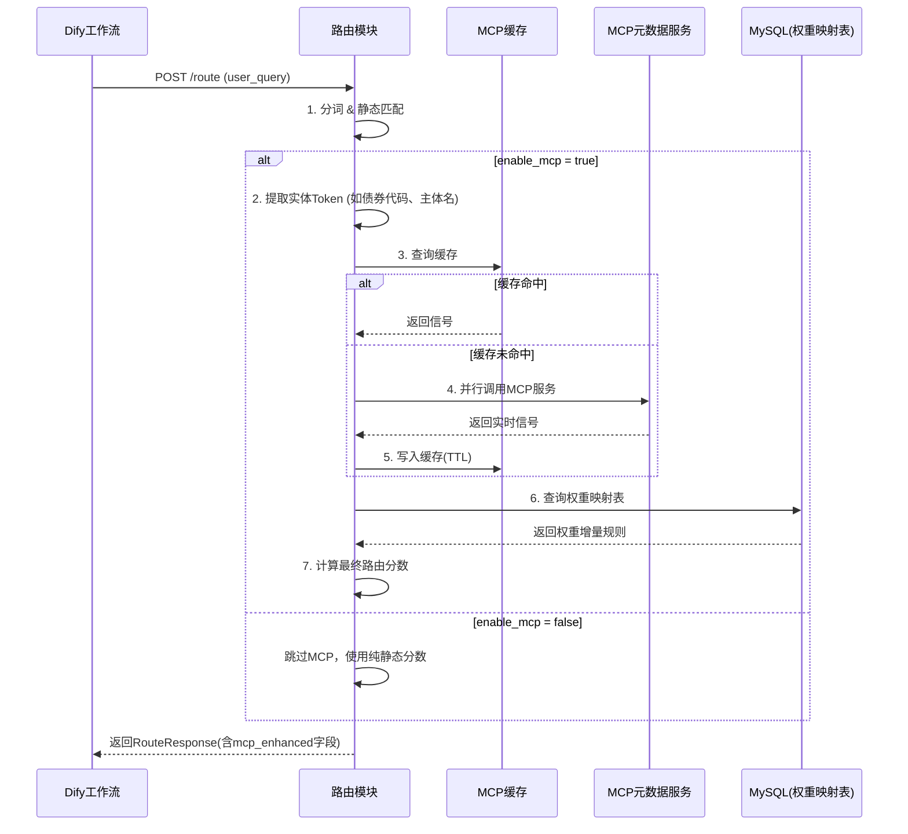

好的，以下是整合了 **MCP 动态元数据集成** 修正方案后的完整接口设计文档。

---

# 全局字典与路由模块 —— 接口设计文档（v2.0）

> **版本更新说明**：本次新增 MCP（模型上下文协议）动态元数据集成能力，将实时业务信号纳入路由决策。所有新增/修改内容已用 **📌** 标注。


## 一、文档概述

| 项目 | 说明 |
| :--- | :--- |
| **模块名称** | 全局字典与路由模块（Global Router Module） |
| **模块职责** | 根据用户问题，通过 **静态关键词匹配 + 动态 MCP 元数据增强**，自动路由到最相关的知识库，并输出引导话术与标签 |
| **核心升级** | 从“纯静态关键词匹配”升级为“实时上下文感知路由”，MCP 信号作为动态权重叠加因子 |
| **部署方式** | 独立微服务（Python FastAPI），与 Dify 主服务并行运行 |
| **依赖组件** | Dify API（`/datasets`）、MCP 元数据服务集群、Nacos（配置中心）、MySQL（路由日志 + MCP 映射表） |


## 二、对外暴露的 HTTP 接口

### 2.1 核心路由接口

#### 基本信息

| 项目 | 内容 |
| :--- | :--- |
| **接口名称** | 路由查询 |
| **请求方法** | `POST` |
| **请求路径** | `/api/v1/route` |
| **接口协议** | HTTP/HTTPS + JSON |
| **调用方** | Dify 工作流中的 HTTP 请求节点 |
| **超时建议** | 5000 ms（含 MCP 调用，建议客户端 5 秒） |

#### 请求体（Request Body）

```json
{
  "user_query": "城投债的信用利差最近怎么看？",
  "context_kb": "固收投研",
  "enable_mcp": true
}
```

| 字段名 | 类型 | 必填 | 描述 |
| :--- | :--- | :--- | :--- |
| `user_query` | string | 是 | 用户输入的原始问题，最大长度 500 字符 |
| `context_kb` | string | 否 | 用户当前所在的知识库，用于上下文偏置 |
| **`enable_mcp`** 📌 | boolean | 否 | **是否启用 MCP 动态增强，默认 true。设为 false 时仅使用静态匹配** |

#### 响应体（Response Body）

**场景 A：精准命中（clarity_flag = "clear"）**

```json
{
  "status": "success",
  "routed_kbs": ["固收投研"],
  "confidence": 0.85,
  "clarity_flag": "clear",
  "suggested_question": null,
  "filter_tags": ["城投债", "利差"],
  "matched_keywords": ["城投债", "利差"],
  "mcp_enhanced": false,
  "mcp_hint": null
}
```

**场景 B：MCP 动态干预后的精准命中（📌 新增典型场景）**

```json
{
  "status": "success",
  "routed_kbs": ["风控知识库"],
  "confidence": 0.92,
  "clarity_flag": "clear",
  "suggested_question": null,
  "filter_tags": ["城投债", "高风险主体"],
  "matched_keywords": ["城投债", "XX集团"],
  "mcp_enhanced": true,
  "mcp_hint": "当前债券主体触发风险预警，已优先为您匹配风控知识库。"
}
```

**场景 C：歧义命中（clarity_flag = "ambiguous"）**

```json
{
  "status": "success",
  "routed_kbs": ["固收投研", "信评知识库"],
  "confidence": 0.62,
  "clarity_flag": "ambiguous",
  "suggested_question": "您的问题涉及多个知识库，请选择：\n1. 固收投研（含MCP风险提示）\n2. 信评知识库",
  "filter_tags": ["债券", "信用风险"],
  "matched_keywords": ["债券", "风险"],
  "mcp_enhanced": true,
  "mcp_hint": "检测到该债券近期评级下调，建议优先关注信评知识库。"
}
```

**场景 D：零命中（clarity_flag = "unknown"）**

```json
{
  "status": "success",
  "routed_kbs": [],
  "confidence": 0.0,
  "clarity_flag": "unknown",
  "suggested_question": "抱歉，未找到匹配的知识库。您是否想了解以下内容？\n- 债券/固收类 → 固收投研知识库\n- 股票/权益类 → 股票知识库\n请重新描述您的问题。",
  "filter_tags": [],
  "matched_keywords": [],
  "mcp_enhanced": false,
  "mcp_hint": null
}
```

#### 响应字段完整说明

| 字段名 | 类型 | 描述 |
| :--- | :--- | :--- |
| `status` | string | 固定返回 `"success"` |
| `routed_kbs` | array[string] | 推荐的知识库列表，按置信度降序排列，最多 3 个 |
| `confidence` | float | 最高分知识库的置信度，范围 0~1，保留 4 位小数 |
| `clarity_flag` | string | `clear` / `ambiguous` / `unknown` |
| `suggested_question` | string | 当 `clarity_flag = ambiguous` 或 `unknown` 时的引导话术 |
| `filter_tags` | array[string] | 提取出的业务标签，最多 10 个 |
| `matched_keywords` | array[string] | 命中的原始关键词列表，最多 10 个 |
| **`mcp_enhanced`** 📌 | boolean | **本次路由是否受到 MCP 动态信号干预** |
| **`mcp_hint`** 📌 | string | **MCP 干预的原因说明，用于前端展示给用户（可选）** |

#### 错误码

| HTTP Status | `code` | 描述 |
| :--- | :--- | :--- |
| 400 | `invalid_param` | 请求参数缺失或格式错误（如 `user_query` 为空） |
| 500 | `internal_error` | 路由引擎内部异常（如词典加载失败） |
| 503 | `config_unavailable` | 词典配置未加载成功，服务暂不可用 |
| **504** 📌 | `mcp_timeout` | **MCP 服务超时，但已使用降级策略完成路由（响应体中 mcp_enhanced=false）** |


### 2.2 配置热加载接口

#### 基本信息

| 项目 | 内容 |
| :--- | :--- |
| **接口名称** | 热加载配置 |
| **请求方法** | `POST` |
| **请求路径** | `/api/v1/reload` |
| **调用方** | 运维脚本 / 管理员 |

#### 请求体

无。

#### 响应体（📌 增加了 MCP 配置加载状态）

```json
{
  "status": "ok",
  "message": "路由配置已重新加载",
  "kb_count": 9,
  "ambiguous_count": 5,
  "mcp_providers_loaded": 2,
  "mcp_weight_rules_loaded": 15
}
```

| 字段名 | 类型 | 描述 |
| :--- | :--- | :--- |
| `status` | string | `"ok"` 表示成功 |
| `message` | string | 描述信息 |
| `kb_count` | int | 加载后的知识库数量 |
| `ambiguous_count` | int | 加载后的歧义词数量 |
| **`mcp_providers_loaded`** 📌 | int | **成功加载的 MCP 服务提供者数量** |
| **`mcp_weight_rules_loaded`** 📌 | int | **成功加载的信号→权重映射规则数量** |

#### 错误码

| HTTP Status | `code` | 描述 |
| :--- | :--- | :--- |
| 500 | `parse_failed` | MD 文件格式错误，解析失败 |
| 404 | `file_not_found` | 指定的 MD 配置文件不存在 |
| **500** 📌 | `mcp_config_error` | **MCP 映射表加载失败（但不影响静态路由）** |


### 2.3 健康检查接口（📌 增加了 MCP 依赖健康状态）

#### 基本信息

| 项目 | 内容 |
| :--- | :--- |
| **接口名称** | 健康检查 |
| **请求方法** | `GET` |
| **请求路径** | `/api/v1/health` |
| **调用方** | K8s / Docker 探针、监控系统 |

#### 请求体

无。

#### 响应体

```json
{
  "status": "healthy",
  "md_file_exists": true,
  "kb_count": 9,
  "last_modified": "2026-08-05T10:00:00Z",
  "uptime_seconds": 3600,
  "mcp_providers": [
    {
      "name": "RiskMetadataService",
      "status": "healthy",
      "latency_ms": 120,
      "last_success": "2026-08-05T10:00:00Z"
    },
    {
      "name": "RegulatoryAlertService",
      "status": "degraded",
      "latency_ms": 1500,
      "last_success": "2026-08-05T09:55:00Z",
      "error": "timeout"
    }
  ],
  "mcp_overall_status": "degraded"
}
```

| 字段名 | 类型 | 描述 |
| :--- | :--- | :--- |
| `status` | string | `"healthy"` / `"degraded"` / `"unhealthy"` |
| `md_file_exists` | bool | 配置文件是否存在 |
| `kb_count` | int | 已加载的知识库数量 |
| `last_modified` | string | 配置文件最后修改时间（ISO 8601） |
| `uptime_seconds` | int | 服务启动以来的运行秒数 |
| **`mcp_providers`** 📌 | array | **每个 MCP 服务提供者的健康状态详情** |
| **`mcp_overall_status`** 📌 | string | **MCP 整体状态：healthy / degraded / unhealthy** |


## 三、内部模块间接口契约（开发阶段使用）

以下为模块内部分层之间约定的 **抽象接口（Python ABC / Protocol）**。

### 3.1 配置解析器接口（`IRouterParser`）

```python
class IRouterParser(ABC):
    """负责加载和解析配置源（MD文件 / Nacos / 数据库）"""
    
    def load_mapping(self) -> Dict[str, List[Tuple[str, float]]]:
        """返回：{知识库名称: [(关键词, 权重)]}"""
        pass

    def load_ambiguous_map(self) -> List[str]:
        """返回：歧义词列表"""
        pass

    def get_version(self) -> str:
        """返回：配置版本号"""
        pass
```

**实现类**：`MarkdownParser`、`NacosParser`


### 3.2 MCP 元数据客户端接口（📌 新增）

> 这是本次修正的核心新增接口。它负责连接 MCP 元数据服务，拉取实时业务信号。

```python
class IMetadataMCPClient(ABC):
    """负责与 MCP 元数据服务交互，拉取实时信号"""
    
    @abstractmethod
    async def fetch_realtime_context(
        self, 
        tokens: List[str],
        timeout_ms: int = 500
    ) -> Dict[str, Any]:
        """
        输入：分词后的 Token 列表（如 ["贵州", "城投债", "XX集团"]）
        输出：标准化实时信号
        示例返回：{
            "risk_level": "high",
            "regulatory_status": "watchlist",
            "bond_code": "123456",
            "rating_outlook": "negative"
        }
        异常：超时或失败时抛出 MCPTimeoutError / MCPUnavailableError
        """
        pass
    
    @abstractmethod
    async def health_check(self) -> Tuple[bool, int]:
        """
        返回：(是否健康, 延迟毫秒数)
        """
        pass
```

**实现类**：`MCPHttpClient`（通过 HTTP 调用 MCP 服务）


### 3.3 MCP 信号缓存接口（📌 新增）

```python
class IMCPCache(ABC):
    """管理 MCP 查询结果缓存，减少网络调用"""
    
    @abstractmethod
    def get(self, cache_key: str) -> Optional[Dict[str, Any]]:
        """根据缓存键获取缓存的 MCP 响应，未命中返回 None"""
        pass
    
    @abstractmethod
    def set(self, cache_key: str, value: Dict[str, Any], ttl_seconds: int) -> None:
        """缓存 MCP 响应，带 TTL"""
        pass
    
    @abstractmethod
    def invalidate(self, cache_key: str) -> None:
        """主动使某条缓存失效"""
        pass
```

**实现类**：`MySQLMCPCache`（基于 `kb_mcp_cache` 表）


### 3.4 匹配引擎接口（📌 返回值已扩展）

```python
class IRouterMatcher(ABC):
    """核心匹配引擎（已集成 MCP 动态增强）"""
    
    def match(
        self, 
        query: str, 
        context_kb: str = None,
        enable_mcp: bool = True,
        mcp_signals: Dict[str, Any] = None  # 由上层调用时传入
    ) -> Tuple[
        List[str],   # routed_kbs
        float,       # confidence
        str,         # clarity_flag
        str,         # suggested_question
        List[str],   # filter_tags
        List[str],   # matched_keywords
        bool,        # mcp_applied  📌 新增
        str,         # mcp_hint      📌 新增
        Dict[str, Any]  # mcp_details  📌 新增（用于日志）
    ]:
        """
        参数：
            query: 用户问题
            context_kb: 用户当前知识库
            enable_mcp: 是否启用 MCP 增强
            mcp_signals: 上层预取的 MCP 信号（避免重复调用）
        
        返回：
            ...原有6项 + mcp_applied + mcp_hint + mcp_details
        """
        pass
```

**实现类**：`KeywordMatcher`


### 3.5 权重映射器接口（📌 新增）

```python
class IMCPWeightMapper(ABC):
    """将 MCP 信号映射为路由权重增量"""
    
    @abstractmethod
    def map_signals_to_weights(
        self, 
        signals: Dict[str, Any]
    ) -> Dict[str, float]:
        """
        输入：MCP 返回的实时信号
        输出：{知识库名称: 权重增量}
        示例：{"风控知识库": 0.9, "信评知识库": 0.7}
        
        查询 kb_mcp_weight_mapping 表实现
        """
        pass
```

**实现类**：`DatabaseWeightMapper`


### 3.6 Dify 平台客户端接口（保留，无变化）

```python
class IKBClient(ABC):
    """负责与 Dify 平台交互（防腐层）"""
    
    async def fetch_all_kbs(self) -> List[str]:
        """调用 Dify GET /datasets，返回所有有效的 source_kb 名称列表"""
        pass
```

**实现类**：`DifyPlatformClient`


### 3.7 路由日志接口（📌 已扩展 MCP 字段）

```python
class IRouterLogger(ABC):
    """负责记录路由日志"""
    
    def log(
        self,
        request: RouteRequest,
        response: RouteResponse,
        matched_keywords: List[str],
        mcp_applied: bool = False,      # 📌 新增
        mcp_signals: Dict = None,        # 📌 新增
        mcp_weights: Dict = None         # 📌 新增
    ) -> None:
        """
        写入 kb_router_logs 表（含 MCP 追踪字段）
        """
        pass
```

**实现类**：`MysqlRouterLogger`


## 四、与外部系统的接口依赖关系

### 4.1 依赖的 Dify 平台接口

| 序号 | Dify 接口 | 方法 | 用途 | 调用频率 | 超时 |
| :--- | :--- | :--- | :--- | :--- | :--- |
| 1 | `/datasets` | GET | 获取所有知识库列表，校验 MD 中的 source_kb 有效性 | 启动 + 每小时 | 5s |
| 2 | `/datasets/{id}` | GET | 获取单个知识库详情，用于歧义引导展示 | 按需 | 3s |

### 4.2 依赖的 MCP 元数据服务（📌 新增）

| 序号 | 服务类型 | 协议 | 用途 | 调用时机 | 超时要求 |
| :--- | :--- | :--- | :--- | :--- | :--- |
| 1 | 风险评级服务 | HTTP REST | 查询主体/债券的风险等级、评级展望 | 用户问题命中实体关键词时 | ≤ 500ms |
| 2 | 监管动态服务 | HTTP REST | 查询是否被列入监管关注名单 | 用户问题命中实体关键词时 | ≤ 500ms |
| 3 | 舆情标签服务 | HTTP REST | 获取实时的舆情标签热词 | 可选，高并发场景可关闭 | ≤ 300ms |

### 4.3 MCP 调用流程图（📌 新增）



### 4.4 熔断与降级策略（📌 新增）

| 场景 | 降级策略 | 响应表现 |
| :--- | :--- | :--- |
| MCP 服务超时（>500ms） | 忽略 MCP 信号，使用纯静态匹配 | `mcp_enhanced = false`，路由结果仍返回 |
| MCP 服务连续失败 ≥ 5 次 | 触发熔断，10 秒内不调用该 MCP | 同上，熔断期间快速降级 |
| MCP 服务返回异常数据 | 校验失败，丢弃该信号 | 记录错误日志，不影响路由 |
| 所有 MCP 服务均不可用 | 全局降级为静态路由 | `mcp_enhanced = false`，不影响核心功能 |


## 五、接口设计变更历史

| 版本 | 日期 | 作者 | 变更说明 |
| :--- | :--- | :--- | :--- |
| v1.0 | 2026-08-05 | 项目组 | 初稿：定义 3 个对外接口 + 4 个内部接口契约 |
| **v2.0** 📌 | **2026-08-06** | **项目组** | **新增 MCP 动态元数据集成：/route 增加 mcp_enhanced/mcp_hint，/health 增加 MCP 健康检查，新增 IMetadataMCPClient/IMCPCache/IMCPWeightMapper 三个内部接口，新增熔断降级策略** |


## 六、📌 与之前版本的核心差异对照表

| 差异项 | v1.0（旧版） | v2.0（新版，含 MCP） |
| :--- | :--- | :--- |
| `/route` 响应体 | 7 个字段 | **9 个字段（+ `mcp_enhanced`、`mcp_hint`）** |
| `/health` 响应体 | 5 个字段 | **8 个字段（+ `mcp_providers`、`mcp_overall_status`）** |
| `/reload` 响应体 | 3 个字段 | **5 个字段（+ `mcp_providers_loaded`、`mcp_weight_rules_loaded`）** |
| 内部接口数量 | 4 个 | **7 个（+ `IMetadataMCPClient`、`IMCPCache`、`IMCPWeightMapper`）** |
| 外部依赖 | 仅 Dify API | **Dify API + MCP 元数据服务集群** |
| 容错能力 | 无 | **熔断 + 降级 + 缓存** |


以上即为整合了 MCP 动态元数据集成的完整接口设计文档。你可以直接使用此文档进行开发联调和向领导汇报。需要我继续帮你推进 **任务5：意图识别、拆解与改写** 的设计吗？