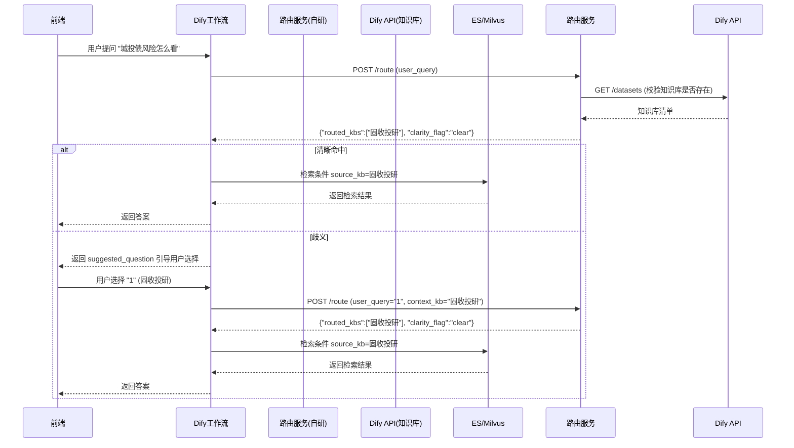

基于你提供的完整 Dify API 参考文档，我来系统分析 **“全局字典与路由”模块** 需要开发哪些接口，以及与 Dify 的哪些接口进行交互。

---

## 一、路由模块需要开发的接口（自研服务）

路由模块作为独立微服务，需要对外暴露以下接口，供 Dify 工作流中的 HTTP 请求节点调用。

### 接口 1：核心路由接口

| 项目 | 内容 |
| :--- | :--- |
| **路径** | `POST /route` |
| **功能** | 接收用户问题，返回路由到的知识库列表、置信度、引导话术等 |
| **调用方** | Dify 工作流中的 HTTP 请求节点 |
| **请求体** | `{"user_query": "城投债利差怎么看", "context_kb": "固收投研"}` |
| **响应体** | `{"status":"success","routed_kbs":["固收投研"],"confidence":0.85,"clarity_flag":"clear","suggested_question":null,"filter_tags":["利差"],"matched_keywords":["城投债"]}` |

### 接口 2：手动重载配置

| 项目 | 内容 |
| :--- | :--- |
| **路径** | `POST /reload` |
| **功能** | 运维人员修改 `global_router.md` 后，手动触发热加载，无需重启服务 |
| **调用方** | 运维脚本 / 管理员 |
| **请求体** | 无 |
| **响应体** | `{"status":"ok","message":"路由配置已重新加载","kb_count":9}` |

### 接口 3：健康检查

| 项目 | 内容 |
| :--- | :--- |
| **路径** | `GET /health` |
| **功能** | 用于 K8s/Docker 探针，检测服务存活及配置是否加载成功 |
| **调用方** | 运维监控系统 |
| **响应体** | `{"status":"healthy","md_file_exists":true,"kb_count":9,"last_modified":"2026-08-05T10:00:00"}` |

---

## 二、路由模块需要与哪些 Dify 接口交互

路由模块在运行过程中，需要从 Dify 获取一些元数据信息，以保持路由结果与 Dify 平台的知识库配置一致。

### 交互 1：获取知识库列表（确保 source_kb 枚举值正确）

| 项目 | 内容 |
| :--- | :--- |
| **Dify 接口** | `GET /datasets` |
| **功能** | 获取工作空间中所有知识库的 ID、名称、权限等信息 |
| **路由模块使用场景** | 启动时或定时拉取，校验 `global_router.md` 中的 `source_kb` 是否与 Dify 平台实际存在的知识库名称一致，避免路由到不存在的知识库 |
| **关键响应字段** | `data[].id`、`data[].name` |

> **为什么需要这个交互**：MD 文件由业务人员手动维护，可能拼写错误或引用了已被删除的知识库。路由模块需要定时同步 Dify 的知识库清单，在匹配时做一层兜底校验，若命中不存在的知识库则降级为 `unknown`。

### 交互 2：获取单个知识库详情（用于歧义引导时的信息展示）

| 项目 | 内容 |
| :--- | :--- |
| **Dify 接口** | `GET /datasets/{dataset_id}` |
| **功能** | 获取知识库的详细描述、文档数量、检索设置等 |
| **路由模块使用场景** | 歧义引导时，返回的知识库名称后可能需要附上一句简短的描述，帮助用户做出选择。可从 Dify 的 `description` 字段获取 |
| **关键响应字段** | `description`、`document_count` |

### 交互 3：（可选）通过 Dify 的 `POST /chat-messages` 做歧义引导后的二次确认

| 项目 | 内容 |
| :--- | :--- |
| **Dify 接口** | `POST /chat-messages` |
| **功能** | 当路由歧义时，返回引导话术给用户；用户二次回复选择后，再次调用路由模块 |
| **路由模块使用场景** | 路由模块不直接与用户交互，而是通过 Dify 工作流完成闭环。路由模块返回 `clarity_flag="ambiguous"` 和 `suggested_question` 后，Dify 工作流应： 1. 将 `suggested_question` 作为回复返回给前端 2. 等待用户二次输入（如 “1” 或 “信评知识库”） 3. 将用户选择映射为 `selected_kb`，再次调用 `/route` 接口，此时路由模块应直接返回该知识库，不再进行二次歧义检测 |

---

## 三、与 Dify 工作流的集成方式（关键时序）

---

## 四、接口总结（路由模块需开发的接口清单）

| 接口 | 方法 | 用途 | 是否必需 |
| :--- | :--- | :--- | :--- |
| `/route` | POST | 核心路由 | ✅ 必需 |
| `/reload` | POST | 热加载配置 | ✅ 推荐 |
| `/health` | GET | 健康检查 | ✅ 推荐 |
| `/stats` | GET | 返回命中率、歧义率等统计（可选） | ⚪ 可选（11月做召回测评时需要） |

---

## 五、路由模块依赖的 Dify 接口清单

| Dify 接口 | 方法 | 用途 | 调用频率 |
| :--- | :--- | :--- | :--- |
| `/datasets` | GET | 获取知识库列表，校验 MD 中的 source_kb | 启动时 / 每小时 |
| `/datasets/{id}` | GET | 获取知识库详情（描述信息用于歧义引导） | 歧义触发时 |
| `/chat-messages` | POST | （可选）将歧义引导话术发送给用户，形成闭环 | 歧义触发时 |

---

## 六、下一步行动建议

1. **先开发 `/route` 核心接口**：这是最关键的接口，其他接口可以后续补齐。
2. **在 Dify 工作流中配置 HTTP 请求节点**：调用 `/route`，并将返回的 `routed_kbs[0]` 映射为 ES 的 `source_kb` 过滤条件。
3. **配置定时任务**：每隔 1 小时调用 Dify 的 `/datasets` 接口，更新本地缓存的知识库清单，确保 MD 文件中的知识库名称始终有效。
4. **编写 Dify 工作流的分支逻辑**：根据 `clarity_flag` 判断是否返回引导话术，等待用户二次输入后再次路由。

如果你需要我帮你生成 `/route` 接口的完整 Flask/FastAPI 实现代码（含与 Dify `/datasets` 交互的逻辑），或者 Dify 工作流中 HTTP 请求节点的详细配置模板，随时告诉我。