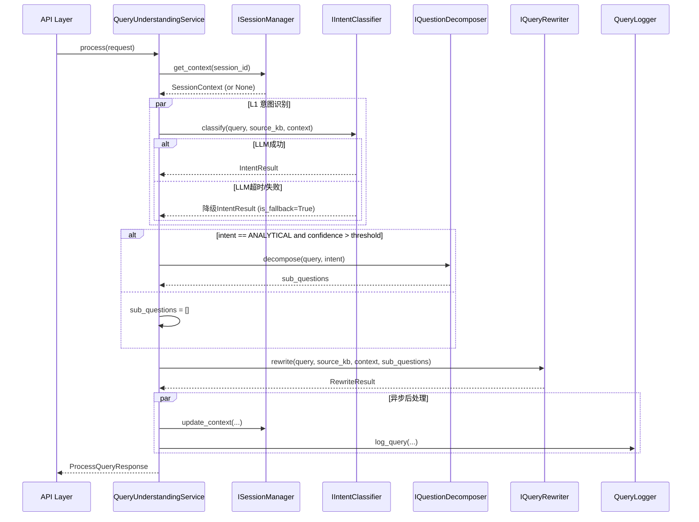

收到，以下是**任务5 模块内部接口设计文档**，延续任务4的4层架构风格，定义各层之间的契约。

---

# 任务5 内部模块接口设计（Query Understanding Internal Interfaces）

> **版本**：v1.0  
> **更新日期**：2026年8月  
> **上游依赖**：任务4（路由模块）输出的`source_kb`  
> **下游消费者**：任务6（混合检索模块）使用`rewritten_queries`进行检索


## 一、整体架构分层

沿用任务4的四层架构，`query_understanding`模块分层如下：

```
┌─────────────────────────────────────────────────────────────┐
│                      API Layer                             │
│            POST /api/v1/query/process                      │
│         (Request → DTO → Service → Response)              │
└─────────────────────────┬───────────────────────────────────┘
                          ▼
┌─────────────────────────────────────────────────────────────┐
│                  Application Layer                         │
│           QueryUnderstandingService                        │
│   编排 L1（规则/LLM分类）→ L2（拆解）→ L3（改写）          │
└─────────────────────────┬───────────────────────────────────┘
                          ▼
┌─────────────────────────────────────────────────────────────┐
│                    Domain Layer                            │
│   IIntentClassifier  IQuestionDecomposer  IQueryRewriter  │
│         ISessionManager          Entities / VOs           │
└─────────────────────────┬───────────────────────────────────┘
                          ▼
┌─────────────────────────────────────────────────────────────┐
│                Infrastructure Layer                        │
│  LLMClassifier  LLMDecomposer  LLMRewriter  RuleFallback  │
│           SessionManager（MySQL实现）                      │
└─────────────────────────────────────────────────────────────┘
```


## 二、领域层接口契约（Domain Interfaces）

所有接口定义在 `app/domain/query_understanding/interfaces.py` 中，使用Python ABC/Protocol定义。

### 2.1 `IIntentClassifier` —— 意图分类器

```python
from abc import ABC, abstractmethod
from typing import Optional
from app.domain.query_understanding.entities import IntentType, IntentResult

class IIntentClassifier(ABC):
    """
    意图分类器接口。
    将用户原始Query分类为FACTUAL/ANALYTICAL/CALCULATION/CHITCHAT/INVALID。
    """

    @abstractmethod
    async def classify(
        self,
        query: str,
        source_kb: Optional[str] = None,
        session_context: Optional[dict] = None,
    ) -> IntentResult:
        """
        对用户Query进行意图分类。

        Args:
            query: 用户原始查询文本
            source_kb: 当前所在知识库（来自路由模块），用于领域偏置
            session_context: 历史会话摘要（来自ISessionManager）

        Returns:
            IntentResult: 包含意图类型、置信度、推理依据

        Raises:
            ClassifierTimeoutError: LLM调用超时（由基础设施层抛出，应用层捕获后降级）
        """
        pass
```

### 2.2 `IQuestionDecomposer` —— 问题拆解器

```python
class IQuestionDecomposer(ABC):
    """
    问题拆解器接口。
    仅对ANALYTICAL类型生效，将复杂问题拆解为有序子问题列表。
    """

    @abstractmethod
    async def decompose(
        self,
        query: str,
        intent: IntentType,
        max_pieces: int = 3,
    ) -> list[str]:
        """
        将复杂问题拆解为多个子问题。

        Args:
            query: 用户原始查询文本
            intent: 意图类型（仅当为ANALYTICAL时执行拆解）
            max_pieces: 最大拆解数量（默认3）

        Returns:
            list[str]: 子问题列表，按逻辑顺序排列（先事实后分析）

        Raises:
            DecomposerTimeoutError: LLM调用超时（降级为原Query）
        """
        pass
```

### 2.3 `IQueryRewriter` —— 查询改写器

```python
class IQueryRewriter(ABC):
    """
    查询改写器接口。
    进行指代消解、术语标准化、同义词扩展，输出1~3条检索Query。
    """

    @abstractmethod
    async def rewrite(
        self,
        query: str,
        source_kb: str,
        session_context: Optional[dict] = None,
        sub_questions: Optional[list[str]] = None,
        max_output: int = 3,
    ) -> RewriteResult:
        """
        将原始Query改写为适合ES检索的规范化Query列表。

        Args:
            query: 用户原始查询
            source_kb: 目标知识库（影响术语标准化方向）
            session_context: 会话上下文（用于指代消解）
            sub_questions: 拆解后的子问题（若有，则合并改写）
            max_output: 最大输出Query数量（默认3）

        Returns:
            RewriteResult: 包含改写Query列表和扩展术语

        Raises:
            RewriterTimeoutError: LLM调用超时（降级为规则兜底）
        """
        pass
```

### 2.4 `ISessionManager` —— 会话管理器

```python
class ISessionManager(ABC):
    """
    会话管理器接口。
    负责读写MySQL中kb_sessions表，维护多轮对话上下文。
    """

    @abstractmethod
    async def get_context(self, session_id: str) -> Optional[SessionContext]:
        """
        获取指定会话的上下文摘要。

        Args:
            session_id: 会话ID（由Dify传入，对应conversation_id）

        Returns:
            SessionContext: 包含最近实体、上一轮Query、历史摘要等；若不存在则返回None
        """
        pass

    @abstractmethod
    async def update_context(
        self,
        session_id: str,
        user_id: str,
        original_query: str,
        rewritten_queries: list[str],
        entities: list[str],
        intent: IntentType,
        source_kb: Optional[str] = None,
    ) -> None:
        """
        更新会话上下文（压缩存储最近3轮QA对）。

        Args:
            session_id: 会话ID
            user_id: 用户标识
            original_query: 用户原始Query
            rewritten_queries: 改写后的Query列表
            entities: 本轮提取的实体列表（如["AAA城投"]）
            intent: 意图类型
            source_kb: 当前知识库
        """
        pass

    @abstractmethod
    async def create_session(
        self,
        session_id: str,
        user_id: str,
        source_kb: Optional[str] = None,
    ) -> None:
        """创建新会话记录（首次出现时调用）"""
        pass
```


## 三、实体与值对象（Domain Entities / Value Objects）

定义在 `app/domain/query_understanding/entities.py` 中。

### 3.1 `IntentType` 枚举

```python
from enum import Enum

class IntentType(str, Enum):
    FACTUAL = "FACTUAL"          # 事实查询（定义、数值、条款）
    ANALYTICAL = "ANALYTICAL"    # 分析推理（需综合多信息判断）
    CALCULATION = "CALCULATION"  # 数据计算（加减乘除、统计）
    CHITCHAT = "CHITCHAT"        # 闲聊/问候
    INVALID = "INVALID"          # 无效/无法理解
```

### 3.2 `IntentResult`

```python
from dataclasses import dataclass

@dataclass
class IntentResult:
    intent: IntentType
    confidence: float           # 0~1
    reasoning: str              # LLM给出的推理理由（或规则命中的模式）
    is_fallback: bool = False   # 是否由规则兜底产生
```

### 3.3 `RewriteResult`

```python
@dataclass
class RewriteResult:
    queries: list[str]          # 改写后的Query列表（1~3条）
    expanded_terms: list[str]   # 扩展同义词/相关术语
    is_fallback: bool = False   # 是否由规则兜底产生
```

### 3.4 `SessionContext`

```python
@dataclass
class SessionContext:
    session_id: str
    user_id: str
    last_query: str                      # 上一轮原始Query
    last_processed: list[str]            # 上一轮改写后的Query列表
    history_summary: dict                # 压缩摘要，如{"entities": ["AAA城投"], "last_intent": "ANALYTICAL"}
    source_kb: Optional[str] = None
```


## 四、应用层服务接口（Application Layer）

定义在 `app/application/query_understanding/service.py`。

### 4.1 `QueryUnderstandingService`

```python
from app.application.query_understanding.dto import ProcessQueryRequest, ProcessQueryResponse

class QueryUnderstandingService:
    """
    查询理解服务，编排L1~L3完整流程。
    依赖注入：classifier, decomposer, rewriter, session_mgr, config_provider
    """

    def __init__(
        self,
        classifier: IIntentClassifier,
        decomposer: IQuestionDecomposer,
        rewriter: IQueryRewriter,
        session_mgr: ISessionManager,
        config_provider: IConfigProvider,   # 从Nacos读取阈值配置
    ):
        self._classifier = classifier
        self._decomposer = decomposer
        self._rewriter = rewriter
        self._session_mgr = session_mgr
        self._config = config_provider

    async def process(
        self,
        request: ProcessQueryRequest,
    ) -> ProcessQueryResponse:
        """
        核心处理方法。

        执行流程：
        1. 加载会话上下文（若session_id存在）
        2. 意图分类（LLM优先，超时则规则兜底）
        3. 若为ANALYTICAL且置信度达标，进行拆解；否则跳过
        4. 查询改写（指代消解 → 术语标准化 → 同义词扩展）
        5. 更新会话上下文（异步）
        6. 记录日志（kb_query_logs）
        7. 返回结果

        Args:
            request: 包含query, session_id, source_kb, user_id, trace_id

        Returns:
            ProcessQueryResponse: 包含意图、子问题、改写Query、扩展术语、耗时等
        """
        pass
```

### 4.2 输入输出DTO（`dto.py`）

```python
from dataclasses import dataclass
from typing import Optional

@dataclass
class ProcessQueryRequest:
    query: str
    session_id: Optional[str] = None
    source_kb: Optional[str] = None
    user_id: Optional[str] = None
    trace_id: Optional[str] = None

@dataclass
class ProcessQueryResponse:
    intent: IntentType
    confidence: float
    sub_questions: list[str]
    rewritten_queries: list[str]
    expanded_terms: list[str]
    processing_time_ms: int
    is_fallback: bool
```


## 五、基础设施层接口（Infrastructure Layer）

### 5.1 `ILLMClient` —— LLM调用封装

```python
from abc import ABC, abstractmethod
from typing import Optional

class ILLMClient(ABC):
    """
    封装对Dify平台LLM的调用（通过 session.model.llm.invoke ）。
    支持超时控制和重试。
    """

    @abstractmethod
    async def invoke_with_timeout(
        self,
        prompt: str,
        system_prompt: Optional[str] = None,
        timeout_seconds: float = 3.0,
        temperature: float = 0.1,
    ) -> str:
        """
        调用LLM，带超时控制。

        Args:
            prompt: 用户提示词
            system_prompt: 系统指令
            timeout_seconds: 超时时间（秒）
            temperature: 温度参数（分类/改写任务建议0.1~0.3）

        Returns:
            str: LLM返回的文本

        Raises:
            LLMTimeoutError: 超时
            LLMConnectionError: 网络异常
        """
        pass
```

### 5.2 `IRuleFallback` —— 规则兜底

```python
class IRuleFallback(ABC):
    """
    正则规则兜底，用于LLM不可用时的降级。
    配置来源于Nacos的 fallback_patterns。
    """

    @abstractmethod
    def classify_by_rules(self, query: str) -> IntentResult:
        """基于正则匹配进行意图分类"""
        pass

    @abstractmethod
    def rewrite_by_rules(self, query: str) -> RewriteResult:
        """
        规则兜底改写：
        - 去除语气词（"请问"、"我想问"等）
        - 保留原Query作为唯一检索词
        - 无同义词扩展
        """
        pass
```

### 5.3 `IConfigProvider` —— 配置提供者

```python
from typing import Any

class IConfigProvider(ABC):
    """
    从Nacos读取运行时配置（query_understanding.yaml）。
    """

    @abstractmethod
    def get(self, key: str, default: Any = None) -> Any:
        """获取配置项，支持点号分隔的嵌套key，如 'intent.confidence_threshold' """
        pass

    @abstractmethod
    async def refresh(self) -> None:
        """热加载最新配置"""
        pass
```


## 六、内部数据流时序图




## 七、配置契约（Nacos → 内部配置对象）

从Nacos读取 `query_understanding.yaml`，映射为以下配置类：

```python
@dataclass
class QueryUnderstandingConfig:
    intent: IntentConfig
    rewrite: RewriteConfig
    fallback_patterns: list[FallbackPattern]

@dataclass
class IntentConfig:
    confidence_threshold: float = 0.65
    max_sub_questions: int = 3

@dataclass
class RewriteConfig:
    max_output_queries: int = 3
    overlap_threshold: float = 0.9

@dataclass
class FallbackPattern:
    pattern: str
    intent: str
```

配置热更新通过 `IConfigProvider.refresh()` 触发，由定时任务（每5分钟）或手动API调用触发。


## 八、错误处理约定（内部异常类）

定义在 `app/domain/query_understanding/exceptions.py`：

| 异常类 | 触发条件 | 应用层处理 |
| :--- | :--- | :--- |
| `ClassifierTimeoutError` | LLM分类超时 | 捕获后切换规则兜底 |
| `DecomposerTimeoutError` | LLM拆解超时 | 忽略拆解，直接进入改写 |
| `RewriterTimeoutError` | LLM改写超时 | 捕获后切换规则兜底 |
| `SessionNotFoundError` | session_id不存在 | 静默忽略，视为新会话 |
| `InvalidQueryError` | Query为空或纯空白 | 直接返回INVALID，不调用LLM |


## 九、接口间依赖关系图

```
┌──────────────────────┐
│  IIntentClassifier   │──uses──▶ ILLMClient
└──────────┬───────────┘
           │
┌──────────▼───────────┐
│ IQuestionDecomposer  │──uses──▶ ILLMClient
└──────────┬───────────┘
           │
┌──────────▼───────────┐
│   IQueryRewriter     │──uses──▶ ILLMClient
└──────────┬───────────┘
           │
┌──────────▼───────────┐
│   ISessionManager    │──uses──▶ MySQL (kb_sessions)
└──────────────────────┘

┌──────────────────────┐
│   IRuleFallback      │──uses──▶ Nacos Config
└──────────────────────┘

┌──────────────────────┐
│   IConfigProvider    │──uses──▶ Nacos
└──────────────────────┘
```

---

以上为任务5的全部内部模块接口设计，涵盖领域层、应用层、基础设施层的完整契约、实体定义、异常约定及数据流时序。如需我继续生成**对应的Python代码骨架**（接口定义 + 各层实现桩代码），请告知。