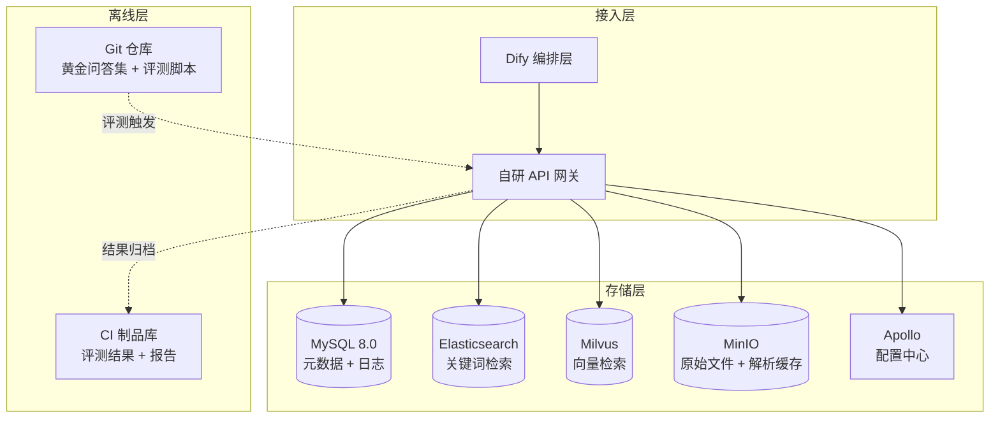
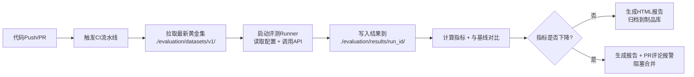

# 知识库统一门户数据模型设计文档（评审终版）

> **文档版本**：v6.4-final（评审加固版）
> **编制日期**：2026年8月
> **编制人**：知识库深度优化项目组
> **密级**：内部公开
> **文档状态**：待评审


## 目录

- [一、文档概述](#一文档概述)
- [二、MySQL 数据模型](#二mysql-数据模型)
- [三、Elasticsearch 索引设计](#三elasticsearch-索引设计)
- [四、Milvus 向量数据库设计](#四milvus-向量数据库设计)
- [五、配置中心设计（Apollo）](#五配置中心设计apollo)
- [六、对象存储设计（MinIO）](#六对象存储设计minio)
- [七、离线评测文件存储模型](#七离线评测文件存储模型)
- [八、跨库一致性保障](#八跨库一致性保障)
- [九、评审加固汇总](#九评审加固汇总)
- [十、版本变更历程](#十版本变更历程)
- [十一、任务覆盖说明](#十一任务覆盖说明)
- [十二、实施顺序建议](#十二实施顺序建议)


## 一、文档概述

### 1.1 背景与目标

本项目基于 Dify 搭建统一知识库门户，覆盖 **9 个业务知识库**：基金、合规、信评、量化、运营、固收投研、股票、风控、前台运维。

整体架构采用 **Dify 做编排 + 自研做核心** 的混合模式，核心存储与计算组件选型如下：

| 组件 | 选型 | 用途 |
| :--- | :--- | :--- |
| **关系数据库** | MySQL 8.0 | 元数据、结构化日志、配置表、反馈闭环数据 |
| **关键词检索引擎** | Elasticsearch | 切块文本全文检索（BM25）+ 元数据过滤 |
| **向量检索引擎** | Milvus | 切块向量语义检索（ANN） |
| **配置中心** | Apollo | 路由、检索、排序、Rerank 等热配置管理 |
| **对象存储** | MinIO | 原始文档文件、解析缓存（`elements.json`） |
| **解析引擎** | MinerU | 文档结构化解析，输出标准化元素 |
| **数据结构** | 父子块结构 | 子块（~256 tokens）用于检索，父块（完整章节）作为上下文返回 |
| **去重机制** | `(source_kb, file_hash)` | 联合唯一约束，跨库隔离 |

### 1.2 设计原则

| 原则 | 说明 |
| :--- | :--- |
| **三库隔离** | MySQL 管元数据与日志，ES 管关键词检索，Milvus 管向量检索，各司其职 |
| **父子块结构** | 子块用于检索召回，父块作为完整章节上下文返回，父块不进检索引擎 |
| **全链路可追溯** | `trace_id` 贯穿所有日志表，支持端到端问题定位 |
| **生产级加固** | 日志按月分区、跨库去重隔离、块级增量变更、N+1 查询优化 |
| **动态信号层** | MCP 引入实时上下文感知路由，静态字典与动态权重叠加决策 |

### 1.3 整体存储架构




## 二、MySQL 数据模型

MySQL 8.0 作为关系型数据库，负责存储元数据、切块原文、标签、版本、反馈、路由日志、会话上下文、查询日志、召回日志（含 Rerank 追踪）、排序日志、MCP 配置、通知日志、Agent 循环轨迹、评估明细、待反问队列、反馈分析日志、反馈聚合统计等结构化数据。**共 21 张核心表**。

### 2.1 文档主表：`kb_documents`

| 字段名 | 类型 | 约束 | 描述 |
| :--- | :--- | :--- | :--- |
| `id` | bigint | PRIMARY KEY AUTO_INCREMENT | 自增主键 |
| `doc_uuid` | varchar(64) | UNIQUE NOT NULL | 文档唯一标识，API使用 |
| `file_name` | varchar(255) | NOT NULL | 原始文件名 |
| `file_hash` | varchar(64) | INDEX | 全文SHA-256，用于版本比对 |
| `file_path` | varchar(512) | | 对象存储路径 |
| `source_kb` | varchar(32) | NOT NULL | 来源知识库：fund/credit/compliance等 |
| `doc_type` | varchar(32) | | 文档类型：研报/公告/合同等 |
| `version` | varchar(16) | DEFAULT 'v1.0' | 当前线上生效的版本号 |
| `indexing_status` | tinyint | DEFAULT 0 | 索引技术状态：`0`-待处理/处理中 / `1`-已索引 / `2`-异常 |
| `lifecycle_status` | varchar(20) | DEFAULT 'draft' | 业务生命周期：`draft` / `published` / `archived` / `pending_approval` / `rejected` |
| `previous_lifecycle_status` | varchar(20) | NULL | 回退锚点 |
| `pending_version` | varchar(16) | NULL | 待审批的新版本号 |
| `approved_by` | varchar(64) | NULL | 审批人ID |
| `approved_at` | datetime | NULL | 审批时间 |
| `reject_reason` | text | NULL | 驳回原因 |
| `published_date` | datetime | INDEX | 文档原始发布日期 |
| `retry_count` | tinyint | DEFAULT 0 | 索引重试次数 |
| `last_error` | text | NULL | 最后一次错误信息 |
| `processing_started_at` | datetime | NULL | 最近一次开始处理的时间 |
| `indexed_at` | datetime | NULL | 三库全部写入完成的时间 |
| `parser_engine` | varchar(64) | NULL | 解析引擎及版本，如"mineru-1.2.0" |
| `created_at` | datetime | DEFAULT CURRENT_TIMESTAMP | 创建时间 |
| `updated_at` | datetime | DEFAULT CURRENT_TIMESTAMP ON UPDATE | 更新时间 |

**关键索引**：
```sql
CREATE INDEX idx_source_kb ON kb_documents(source_kb);
CREATE INDEX idx_indexing_status ON kb_documents(indexing_status);
CREATE INDEX idx_lifecycle_status ON kb_documents(lifecycle_status);
```

**评审加固（P0）** ：去重粒度升级为 `(source_kb, file_hash)` 联合唯一约束，确保同一知识库内不重复，不同知识库允许相同物理文件独立存在。

```sql
ALTER TABLE kb_documents ADD UNIQUE KEY uk_source_kb_file_hash (source_kb, file_hash);
```

### 2.2 切块表：`kb_chunks`

| 字段名 | 类型 | 约束 | 描述 |
| :--- | :--- | :--- | :--- |
| `id` | bigint | PRIMARY KEY AUTO_INCREMENT | 自增主键 |
| `chunk_uuid` | varchar(64) | UNIQUE NOT NULL | 切块唯一ID，三库关联主键 |
| `doc_id` | bigint | FOREIGN KEY NOT NULL | 关联文档主表 |
| `parent_chunk_id` | bigint | FOREIGN KEY NULL | 父块ID（自关联） |
| `content_type` | varchar(16) | DEFAULT 'CHILD' | PARENT / CHILD |
| `content_text` | longtext | NOT NULL | 切块正文 |
| `chapter_path` | varchar(512) | | 章节路径 |
| `token_count` | int | | Token数量 |
| `source_elem_ids` | json | NULL | 引用的解析器原始元素ID列表，用于溯源高亮 |
| `page_numbers` | varchar(64) | NULL | 该块覆盖的页码范围 |
| `chunk_hash` | varchar(64) | INDEX | 块级内容指纹（`content_text+chapter_path` MD5），用于增量更新 |
| `is_active` | tinyint | DEFAULT 1 | 1-生效 / 0-已废弃 |
| `created_at` | datetime | DEFAULT CURRENT_TIMESTAMP | 创建时间 |

**关键索引**：
```sql
CREATE INDEX idx_doc_id ON kb_chunks(doc_id);
CREATE INDEX idx_parent_chunk ON kb_chunks(parent_chunk_id);
CREATE INDEX idx_is_active ON kb_chunks(is_active);
CREATE INDEX idx_chunk_hash ON kb_chunks(chunk_hash);
```

**评审加固（P1）** ：新增 `chunk_hash` 字段，版本升级时比对 Hash 集合，仅增删改差异块，避免全量重建。

### 2.3 标签表：`kb_tags`

| 字段名 | 类型 | 约束 | 描述 |
| :--- | :--- | :--- | :--- |
| `id` | bigint | PRIMARY KEY AUTO_INCREMENT | 自增主键 |
| `tag_name` | varchar(64) | UNIQUE NOT NULL | 标签名称 |
| `tag_category` | varchar(32) | | industry / topic / risk / region / auto_extracted |
| `is_active` | tinyint | DEFAULT 1 | 是否启用 |

> **说明**：`tag_category` 中的 `auto_extracted` 用于标注路由模块或 MCP 自动提取并补齐的标签。

### 2.4 文档标签关联表：`kb_doc_tag_relation`

| 字段名 | 类型 | 约束 | 描述 |
| :--- | :--- | :--- | :--- |
| `id` | bigint | PRIMARY KEY AUTO_INCREMENT | 自增主键 |
| `doc_id` | bigint | FOREIGN KEY NOT NULL | 文档ID |
| `tag_id` | bigint | FOREIGN KEY NOT NULL | 标签ID |

```sql
CREATE UNIQUE INDEX idx_unique_doc_tag ON kb_doc_tag_relation(doc_id, tag_id);
```

### 2.5 投研实体映射表：`kb_entity_mapping`

| 字段名 | 类型 | 约束 | 描述 |
| :--- | :--- | :--- | :--- |
| `id` | bigint | PRIMARY KEY AUTO_INCREMENT | 自增主键 |
| `chunk_id` | bigint | FOREIGN KEY NOT NULL | 关联切块 |
| `entity_type` | varchar(16) | NOT NULL | bond_code / fund_code / stock_code |
| `entity_code` | varchar(64) | NOT NULL | 实体编码 |

```sql
CREATE INDEX idx_entity ON kb_entity_mapping(entity_type, entity_code);
```

### 2.6 版本变更记录表：`kb_version_changes`

| 字段名 | 类型 | 约束 | 描述 |
| :--- | :--- | :--- | :--- |
| `id` | bigint | PRIMARY KEY AUTO_INCREMENT | 自增主键 |
| `doc_id` | bigint | FOREIGN KEY NOT NULL | 文档ID |
| `change_type` | varchar(20) | NOT NULL | `new_upload` / `version_upgrade` / `manual_archive` / `manual_reactivate` |
| `old_version` | varchar(16) | | 旧版本号 |
| `new_version` | varchar(16) | | 新版本号 |
| `change_summary` | text | NULL | 变更摘要 |
| `approved_by` | varchar(64) | NULL | 审批人ID |
| `created_at` | datetime | DEFAULT CURRENT_TIMESTAMP | 创建时间 |

### 2.7 用户反馈表：`kb_user_feedback`（v6.4 扩展）

| 字段名 | 类型 | 约束 | 描述 |
| :--- | :--- | :--- | :--- |
| `id` | bigint | PRIMARY KEY AUTO_INCREMENT | 自增主键 |
| `trace_id` | varchar(64) | INDEX | 全链路追踪ID |
| `session_id` | varchar(64) | NULL | 会话ID |
| `original_query` | text | NULL | 用户原始问句 |
| `thumbs_up` | tinyint | | 1-点赞 / 0-点踩 |
| `comment` | varchar(500) | | 用户备注 |
| `feedback_category` | varchar(32) | NULL | 问题分类：`route_error` / `intent_error` / `retrieval_failure` / `rank_bias` / `knowledge_gap` / `generation_error` / `context_truncation` / `other` |
| `root_cause_analysis` | json | NULL | 根因分析详细结果 |
| `analysis_status` | varchar(16) | DEFAULT 'pending' | `pending` / `analyzing` / `completed` / `failed` / `manual_review` |
| `analyzed_at` | datetime | NULL | 根因分析完成时间 |
| `analysis_confidence` | decimal(3,2) | NULL | 置信度（0-1） |
| `optimization_suggestion` | json | NULL | 优化建议 |
| `optimization_status` | varchar(16) | DEFAULT 'pending' | `pending` / `approved` / `rejected` / `implemented` / `verified` |
| `related_change_id` | varchar(64) | NULL | 关联的变更任务ID |
| `reviewer_id` | varchar(64) | NULL | 人工复核人ID |
| `reviewed_at` | datetime | NULL | 人工复核时间 |
| `rewritten_query_used` | text | NULL | 系统使用的改写Query |
| `rewrite_helpful` | tinyint | NULL | 改写是否有帮助 |
| `router_snapshot` | json | NULL | 路由决策快照 |
| `selected_kb` | varchar(32) | NULL | 用户实际选择的知识库 |
| `search_snapshot` | json | NULL | 召回快照 |
| `retrieved_chunks` | json | NULL | 实际返回的 `chunk_uuid` 列表 |
| `search_helpful` | tinyint | NULL | 召回内容是否相关 |
| `rank_helpful` | tinyint | NULL | 排序是否合理 |
| `rank_snapshot` | json | NULL | 排序决策快照 |
| `created_at` | datetime | DEFAULT CURRENT_TIMESTAMP | 创建时间 |
| `updated_at` | datetime | DEFAULT CURRENT_TIMESTAMP ON UPDATE | 更新时间 |

```sql
CREATE INDEX idx_trace_id ON kb_user_feedback(trace_id);
CREATE INDEX idx_analysis_status ON kb_user_feedback(analysis_status);
CREATE INDEX idx_optimization_status ON kb_user_feedback(optimization_status);
CREATE INDEX idx_category_created ON kb_user_feedback(feedback_category, created_at);
```

### 2.8 路由日志表：`kb_router_logs`（含 MCP 追踪）

| 字段名 | 类型 | 约束 | 描述 |
| :--- | :--- | :--- | :--- |
| `id` | bigint | PRIMARY KEY AUTO_INCREMENT | 自增主键 |
| `trace_id` | varchar(64) | NOT NULL INDEX | 全链路追踪ID |
| `user_query` | varchar(500) | NOT NULL | 用户原始问题 |
| `context_kb` | varchar(32) | NULL | 请求时的上下文知识库 |
| `routed_kbs` | json | NOT NULL | 路由返回的候选库列表 |
| `clarity_flag` | varchar(16) | NOT NULL | clear / ambiguous / unknown |
| `confidence` | decimal(4,3) | NOT NULL | 置信度 |
| `matched_keywords` | json | NULL | 命中的关键词列表 |
| `filter_tags` | json | NULL | 提取的标签 |
| `mcp_triggered` | tinyint | DEFAULT 0 | 是否触发了MCP动态干预 |
| `mcp_signals` | json | NULL | MCP返回的原始信号快照 |
| `mcp_weight_applied` | json | NULL | MCP信号映射的权重增量 |
| `selected_kb` | varchar(32) | NULL | 用户最终选择的知识库 |
| `is_resolved` | tinyint | DEFAULT 0 | 0-待确认 / 1-已完成 |
| `created_at` | datetime | DEFAULT CURRENT_TIMESTAMP | 创建时间 |

```sql
CREATE INDEX idx_trace_id ON kb_router_logs(trace_id);
CREATE INDEX idx_mcp_triggered ON kb_router_logs(mcp_triggered);
```

### 2.9 会话上下文表：`kb_sessions`

| 字段名 | 类型 | 约束 | 描述 |
| :--- | :--- | :--- | :--- |
| `session_id` | varchar(64) | PRIMARY KEY | 会话ID |
| `user_id` | varchar(64) | NOT NULL | 用户标识 |
| `user_role` | varchar(32) | NULL | 用户角色（基金经理/风控专员等） |
| `source_kb` | varchar(32) | NULL | 当前会话主要知识库 |
| `history_summary` | text | NULL | 历史对话摘要（JSON） |
| `last_query` | text | NULL | 上一轮用户问句 |
| `last_processed` | text | NULL | 上一轮改写Query列表 |
| `agent_state` | json | NULL | 序列化的 LangGraph State |
| `loop_status` | varchar(16) | DEFAULT 'idle' | `idle` / `processing` / `waiting_for_user` / `completed` / `rejected` |
| `created_at` | datetime | DEFAULT CURRENT_TIMESTAMP | 创建时间 |
| `updated_at` | datetime | DEFAULT CURRENT_TIMESTAMP ON UPDATE | 更新时间 |

### 2.10 查询处理日志表：`kb_query_logs`

| 字段名 | 类型 | 约束 | 描述 |
| :--- | :--- | :--- | :--- |
| `log_id` | bigint | PRIMARY KEY AUTO_INCREMENT | 自增主键 |
| `trace_id` | varchar(64) | NOT NULL INDEX | 全链路追踪ID |
| `session_id` | varchar(64) | NULL | 会话ID |
| `original_query` | text | NOT NULL | 用户原始输入 |
| `intent_type` | varchar(32) | NULL | 意图类型 |
| `confidence` | decimal(4,3) | NULL | 置信度 |
| `is_decomposed` | tinyint(1) | DEFAULT 0 | 是否触发拆解 |
| `sub_questions` | json | NULL | 拆解后的子问题列表 |
| `rewritten_queries` | json | NOT NULL | 最终改写Query列表 |
| `expanded_terms` | json | NULL | 扩展的同义词列表 |
| `llm_call_duration_ms` | int | NULL | LLM总耗时 |
| `fallback_triggered` | tinyint(1) | DEFAULT 0 | 是否触发降级 |
| `is_multi_step` | tinyint(1) | DEFAULT 0 | 是否触发了多步规划 |
| `total_agent_rounds` | tinyint | DEFAULT 0 | Agent循环总轮数 |
| `final_agent_decision` | varchar(16) | NULL | `answer` / `ask` / `reject` |
| `final_answer_preview` | text | NULL | 最终回答的前200字预览 |
| `eval_run_id` | varchar(64) | NULL | **评审新增**：关联任务10评测运行批次 |
| `golden_set_version` | varchar(16) | NULL | **评审新增**：黄金问答集版本 |
| `created_at` | datetime | DEFAULT CURRENT_TIMESTAMP | 创建时间 |

**评审加固（P0）** ：新增 `eval_run_id` 和 `golden_set_version` 字段，打通线上反馈与离线评测闭环。

### 2.11 召回日志表：`kb_search_logs`（含 Rerank 追踪）

| 字段名 | 类型 | 约束 | 描述 |
| :--- | :--- | :--- | :--- |
| `id` | bigint | PRIMARY KEY AUTO_INCREMENT | 自增主键 |
| `trace_id` | varchar(64) | NOT NULL INDEX | 全链路追踪ID |
| `session_id` | varchar(64) | NULL | 会话ID |
| `original_query` | text | NOT NULL | 用户原始输入 |
| `rewritten_query` | text | NULL | 改写后的主Query |
| `sub_questions` | json | NULL | 拆解后的子问题列表 |
| `tag_filters` | json | NULL | 标签筛选条件 |
| `entity_constraints` | json | NULL | 投研实体代码列表 |
| `source_kb` | varchar(32) | NULL | 路由锁定的知识库 |
| `semantic_query` | text | NULL | 送给Milvus的查询文本 |
| `keyword_query` | text | NULL | 送给ES的查询文本 |
| `semantic_top_k` | int | DEFAULT 50 | 语义通路召回数 |
| `keyword_top_k` | int | DEFAULT 50 | 关键词通路召回数 |
| `semantic_hits` | int | NULL | 语义通路命中数 |
| `keyword_hits` | int | NULL | 关键词通路命中数 |
| `fuzzy_hits` | int | NULL | 模糊通路命中数 |
| `overlap_count` | int | NULL | 多路召回重叠数 |
| `rerank_enabled` | tinyint(1) | DEFAULT 0 | 是否启用了Rerank模型精排 |
| `rerank_model` | varchar(64) | NULL | Rerank模型标识 |
| `rerank_input_count` | int | NULL | 送入Rerank的候选块数量 |
| `rerank_latency_ms` | int | NULL | Rerank调用耗时 |
| `rrf_params` | json | NULL | RRF融合参数快照 |
| `final_result_count` | int | NULL | 最终返回数量 |
| `semantic_latency_ms` | int | NULL | Milvus检索耗时 |
| `keyword_latency_ms` | int | NULL | ES检索耗时 |
| `fusion_latency_ms` | int | NULL | 融合排序耗时 |
| `fallback_triggered` | tinyint(1) | DEFAULT 0 | 是否触发宽松召回 |
| `status` | tinyint | DEFAULT 1 | 1=成功 / 0=失败 |
| `error_msg` | text | NULL | 异常信息 |
| `created_at` | datetime | DEFAULT CURRENT_TIMESTAMP | 创建时间 |

### 2.12 排序日志表：`kb_rank_logs`

| 字段名 | 类型 | 约束 | 描述 |
| :--- | :--- | :--- | :--- |
| `id` | bigint | PRIMARY KEY AUTO_INCREMENT | 自增主键 |
| `trace_id` | varchar(64) | NOT NULL INDEX | 全链路追踪ID |
| `session_id` | varchar(64) | NULL | 会话ID |
| `user_role` | varchar(32) | NULL | 本次请求使用的用户角色 |
| `candidate_count` | int | NOT NULL | 排序前候选集大小 |
| `ranked_count` | int | NOT NULL | 排序后输出数量 |
| `used_weights` | json | NOT NULL | 实际使用的权重三元组 |
| `authority_coefficients` | json | NULL | 文档来源系数快照 |
| `time_decay_lambda` | decimal(4,3) | NULL | 时效衰减率 |
| `diversity_mode` | varchar(16) | NULL | 多样性策略 |
| `max_chunks_per_doc` | int | DEFAULT 3 | 单个文档最大块数 |
| `scenario_boosts` | json | NULL | 场景加成系数 |
| `final_top_scores` | json | NULL | Top-5排序块得分 |
| `total_latency_ms` | int | NULL | 排序环节总耗时 |
| `created_at` | datetime | DEFAULT CURRENT_TIMESTAMP | 创建时间 |

### 2.13 MCP 服务提供者配置表：`kb_mcp_providers`

| 字段名 | 类型 | 约束 | 描述 |
| :--- | :--- | :--- | :--- |
| `id` | bigint | PRIMARY KEY AUTO_INCREMENT | 自增主键 |
| `provider_name` | varchar(64) | UNIQUE NOT NULL | 服务名称 |
| `endpoint_url` | varchar(255) | NOT NULL | MCP服务地址 |
| `auth_type` | varchar(16) | DEFAULT 'none' | 鉴权方式 |
| `auth_credential` | varchar(255) | NULL | 加密凭证 |
| `timeout_ms` | int | DEFAULT 500 | 超时（毫秒） |
| `cache_ttl_seconds` | int | DEFAULT 120 | 缓存有效期 |
| `retry_count` | tinyint | DEFAULT 1 | 最大重试次数 |
| `is_active` | tinyint | DEFAULT 1 | 是否启用 |
| `priority` | int | DEFAULT 0 | 调用优先级 |
| `description` | varchar(255) | NULL | 服务描述 |
| `created_at` | datetime | DEFAULT CURRENT_TIMESTAMP | 创建时间 |
| `updated_at` | datetime | DEFAULT CURRENT_TIMESTAMP ON UPDATE | 更新时间 |

### 2.14 MCP 信号→路由权重映射表：`kb_mcp_weight_mapping`

| 字段名 | 类型 | 约束 | 描述 |
| :--- | :--- | :--- | :--- |
| `id` | bigint | PRIMARY KEY AUTO_INCREMENT | 自增主键 |
| `provider_id` | bigint | FOREIGN KEY NOT NULL | 关联 `kb_mcp_providers.id` |
| `signal_key` | varchar(64) | NOT NULL | MCP字段名 |
| `signal_value` | varchar(64) | NOT NULL | MCP具体值 |
| `target_kb` | varchar(32) | NOT NULL | 目标知识库 |
| `weight_delta` | decimal(4,2) | NOT NULL | 权重增量 |
| `expire_seconds` | int | DEFAULT 0 | 有效期（秒），0=永久 |
| `operator` | varchar(16) | DEFAULT 'eq' | 比较运算符 |
| `is_active` | tinyint | DEFAULT 1 | 是否启用 |
| `created_at` | datetime | DEFAULT CURRENT_TIMESTAMP | 创建时间 |
| `updated_at` | datetime | DEFAULT CURRENT_TIMESTAMP ON UPDATE | 更新时间 |

### 2.15 MCP 实时信号缓存表：`kb_mcp_cache`

| 字段名 | 类型 | 约束 | 描述 |
| :--- | :--- | :--- | :--- |
| `id` | bigint | PRIMARY KEY AUTO_INCREMENT | 自增主键 |
| `cache_key` | varchar(255) | UNIQUE NOT NULL | 查询实体哈希（SHA256） |
| `provider_id` | bigint | FOREIGN KEY NOT NULL | 关联 `kb_mcp_providers.id` |
| `request_tokens` | json | NOT NULL | 原始Token列表 |
| `response_payload` | json | NOT NULL | MCP返回快照 |
| `expires_at` | datetime | NOT NULL | 过期时间 |
| `hit_count` | int | DEFAULT 0 | 缓存命中次数 |
| `created_at` | datetime | DEFAULT CURRENT_TIMESTAMP | 创建时间 |

### 2.16 通知日志表：`kb_notification_logs`

| 字段名 | 类型 | 约束 | 描述 |
| :--- | :--- | :--- | :--- |
| `id` | bigint | PRIMARY KEY AUTO_INCREMENT | 自增主键 |
| `doc_id` | bigint | FOREIGN KEY NOT NULL | 关联 `kb_documents.id` |
| `trace_id` | varchar(64) | NULL | 关联全链路追踪 |
| `channel` | varchar(16) | NOT NULL | `email` / `webhook` / `admin_panel` |
| `recipient` | varchar(255) | NOT NULL | 收件人邮箱或用户名 |
| `subject` | varchar(255) | NOT NULL | 通知标题 |
| `content` | text | NOT NULL | 通知内容快照 |
| `status` | tinyint | DEFAULT 0 | `0`-待发送 / `1`-已发送 / `2`-发送失败 |
| `retry_count` | tinyint | DEFAULT 0 | 重试次数 |
| `error_msg` | text | NULL | 失败原因 |
| `sent_at` | datetime | NULL | 发送成功时间 |
| `created_at` | datetime | DEFAULT CURRENT_TIMESTAMP | 创建时间 |

### 2.17 Agent 循环轨迹表：`kb_agent_loop_traces`

| 字段名 | 类型 | 约束 | 描述 |
| :--- | :--- | :--- | :--- |
| `id` | bigint | PRIMARY KEY AUTO_INCREMENT | 自增主键 |
| `trace_id` | varchar(64) | NOT NULL INDEX | 关联 `kb_query_logs.trace_id` |
| `session_id` | varchar(64) | NULL | 会话ID |
| `round` | tinyint | NOT NULL | 当前轮数（从1开始） |
| `step_sequence` | tinyint | NOT NULL | 本轮内的步骤序号 |
| `step_type` | varchar(16) | NOT NULL | `thought` / `action` / `observation` / `final_answer` |
| `llm_messages_snapshot` | json | NULL | 完整Prompt快照 |
| `thought_content` | text | NULL | 模型思考内容 |
| `tool_name` | varchar(32) | NULL | 调用的工具名 |
| `tool_input` | json | NULL | 工具入参 |
| `tool_output_summary` | text | NULL | 工具返回结果摘要 |
| `tool_latency_ms` | int | NULL | 工具调用耗时 |
| `llm_prompt_tokens` | int | NULL | Prompt Token消耗 |
| `llm_completion_tokens` | int | NULL | 生成Token消耗 |
| `created_at` | datetime | DEFAULT CURRENT_TIMESTAMP | 创建时间 |

### 2.18 评估结果明细表：`kb_evaluation_results`

| 字段名 | 类型 | 约束 | 描述 |
| :--- | :--- | :--- | :--- |
| `id` | bigint | PRIMARY KEY AUTO_INCREMENT | 自增主键 |
| `trace_id` | varchar(64) | NOT NULL INDEX | 关联 `kb_query_logs.trace_id` |
| `round` | tinyint | NOT NULL | 评估发生在第几轮 |
| `overall_confidence` | decimal(4,3) | NOT NULL | 综合置信度 |
| `dimension_relevance` | decimal(4,3) | NULL | 相关性得分 |
| `dimension_coverage` | decimal(4,3) | NULL | 信息覆盖度得分 |
| `dimension_authority` | decimal(4,3) | NULL | 来源权威性得分 |
| `dimension_consistency` | decimal(4,3) | NULL | 多轮一致性得分 |
| `missing_info` | json | NULL | 缺失信息清单 |
| `contradictions_detected` | json | NULL | 检测到的矛盾详情 |
| `decision` | varchar(16) | NOT NULL | `continue` / `ask` / `reject` / `answer` |
| `eval_run_id` | varchar(64) | NULL | **评审新增**：关联任务10评测运行批次 |
| `golden_set_version` | varchar(16) | NULL | **评审新增**：黄金问答集版本 |
| `created_at` | datetime | DEFAULT CURRENT_TIMESTAMP | 创建时间 |

### 2.19 待反问队列表：`kb_pending_questions`

| 字段名 | 类型 | 约束 | 描述 |
| :--- | :--- | :--- | :--- |
| `id` | bigint | PRIMARY KEY AUTO_INCREMENT | 自增主键 |
| `trace_id` | varchar(64) | UNIQUE NOT NULL | 关联 `kb_query_logs.trace_id` |
| `session_id` | varchar(64) | NOT NULL | 会话ID |
| `asked_question` | text | NOT NULL | 向用户展示的反问内容 |
| `context_snapshot` | json | NOT NULL | 反问时的Agent状态快照 |
| `status` | tinyint | DEFAULT 0 | `0`-等待回复 / `1`-已回复 / `2`-超时取消 |
| `user_response` | text | NULL | 用户的回复内容 |
| `responded_at` | datetime | NULL | 用户回复的时间 |
| `expires_at` | datetime | NOT NULL | 反问有效期 |
| `created_at` | datetime | DEFAULT CURRENT_TIMESTAMP | 创建时间 |

### 2.20 反馈根因分析日志表：`kb_feedback_analysis_logs`

| 字段名 | 类型 | 约束 | 描述 |
| :--- | :--- | :--- | :--- |
| `id` | bigint | PRIMARY KEY AUTO_INCREMENT | 自增主键 |
| `feedback_id` | bigint | FOREIGN KEY NOT NULL | 关联 `kb_user_feedback.id` |
| `trace_id` | varchar(64) | INDEX | 全链路追踪ID |
| `analysis_trigger` | varchar(16) | DEFAULT 'auto' | `auto` / `manual` |
| `rule_hit` | varchar(64) | NULL | 规则初筛命中 |
| `retrieval_logs_snapshot` | json | NULL | 召回日志关键字段快照 |
| `rank_logs_snapshot` | json | NULL | 排序日志关键字段快照 |
| `agent_traces_snapshot` | json | NULL | Agent循环轨迹摘要 |
| `llm_analysis_input` | text | NULL | 喂给LLM的完整Prompt |
| `llm_analysis_output` | text | NULL | LLM原始输出（JSON） |
| `llm_model_used` | varchar(64) | NULL | 本次分析使用的模型 |
| `llm_prompt_tokens` | int | NULL | Prompt Token消耗 |
| `llm_completion_tokens` | int | NULL | 生成Token消耗 |
| `final_category` | varchar(32) | NULL | 最终确认的分类 |
| `final_root_cause` | text | NULL | 最终确认的根因描述 |
| `confidence_score` | decimal(3,2) | NULL | 最终置信度 |
| `analysis_duration_ms` | int | NULL | 分析总耗时 |
| `created_at` | datetime | DEFAULT CURRENT_TIMESTAMP | 创建时间 |

### 2.21 反馈聚合统计表：`kb_feedback_stats`

| 字段名 | 类型 | 约束 | 描述 |
| :--- | :--- | :--- | :--- |
| `id` | bigint | PRIMARY KEY AUTO_INCREMENT | 自增主键 |
| `stat_date` | date | NOT NULL | 统计日期 |
| `source_kb` | varchar(32) | NOT NULL | 知识库名称 |
| `total_feedback` | int | DEFAULT 0 | 当日总反馈数 |
| `positive_count` | int | DEFAULT 0 | 点赞数 |
| `negative_count` | int | DEFAULT 0 | 点踩数 |
| `category_route_error` | int | DEFAULT 0 | 路由错误导致点踩数 |
| `category_intent_error` | int | DEFAULT 0 | 意图理解错误导致点踩数 |
| `category_retrieval_failure` | int | DEFAULT 0 | 召回失败导致点踩数 |
| `category_rank_bias` | int | DEFAULT 0 | 排序偏差导致点踩数 |
| `category_knowledge_gap` | int | DEFAULT 0 | 知识缺失导致点踩数 |
| `category_generation_error` | int | DEFAULT 0 | 生成错误导致点踩数 |
| `category_context_truncation` | int | DEFAULT 0 | 上下文截断导致点踩数 |
| `category_other` | int | DEFAULT 0 | 其他/未分类点踩数 |
| `avg_analysis_duration_ms` | int | NULL | 当日平均分析耗时 |
| `auto_analysis_rate` | decimal(3,2) | NULL | 自动分析完成率 |
| `avg_confidence` | decimal(3,2) | NULL | 当日平均分析置信度 |
| `created_at` | datetime | DEFAULT CURRENT_TIMESTAMP | 创建时间 |
| `updated_at` | datetime | DEFAULT CURRENT_TIMESTAMP ON UPDATE | 更新时间 |

```sql
CREATE UNIQUE INDEX uk_date_kb ON kb_feedback_stats(stat_date, source_kb);
```


## 三、Elasticsearch 索引设计

### 3.1 索引名：`kb_chunks_v1`

```json
{
  "settings": {
    "number_of_shards": 3,
    "number_of_replicas": 1,
    "analysis": {
      "analyzer": {
        "ik_max_word_analyzer": {
          "type": "custom",
          "tokenizer": "ik_max_word"
        }
      }
    }
  },
  "mappings": {
    "properties": {
      "chunk_uuid": {"type": "keyword"},
      "doc_id": {"type": "long"},
      "parent_chunk_id": {"type": "long"},
      "chunk_type": {"type": "keyword"},
      "content_text": {
        "type": "text",
        "analyzer": "ik_max_word",
        "search_analyzer": "ik_smart"
      },
      "chapter_path": {"type": "keyword"},
      "source_kb": {"type": "keyword"},
      "doc_type": {"type": "keyword"},
      "published_date": {"type": "date"},
      "tags": {"type": "keyword"},
      "entity_codes": {"type": "keyword"},
      "is_active": {"type": "boolean"}
    }
  }
}
```

### 3.2 评审加固说明

**评审加固（P0）** ：ES 映射中新增 `chunk_type` 字段（keyword 类型），**所有检索 Query 必须强制带 `must: { term: { chunk_type: "CHILD" } }`**，确保父块不参与关键词匹配与排序，杜绝父块污染召回结果的风险。

**评审加固（P2）** ：需同步维护 ES 专有词典（资管领域术语如"城投债"、"久期"、"信用利差"），与 MinerU 解析器联动，确保专业术语准确分词。


## 四、Milvus 向量数据库设计

### 4.1 Collection 名：`kb_embeddings_v1`

| 字段名 | 类型 | 约束 | 描述 |
| :--- | :--- | :--- | :--- |
| `chunk_uuid` | VARCHAR(64) | PRIMARY KEY | 与ES/MySQL保持一致 |
| `embedding` | FLOAT_VECTOR(1536) | NOT NULL | 向量 |
| `source_kb` | VARCHAR(32) | PARTITION KEY | 分区键 |
| `chunk_type` | VARCHAR(16) | | CHILD / PARENT |
| `is_active` | BOOL | | 是否生效 |

### 4.2 评审加固说明

**评审加固（P0）** ：Milvus 中新增 `chunk_type` 标量字段，检索时通过 `expr: "chunk_type == 'CHILD'"` 强制过滤，先过滤再 ANN 检索。


## 五、配置中心设计（Apollo）

采用 **Apollo** 作为配置中心，利用其灰度发布、一键回滚、权限管控和操作审计等企业级特性，满足资管行业对配置变更的严苛管控要求。自研服务通过 Apollo 客户端实时拉取配置，所有配置支持 **动态刷新**，无需重启服务。

### 5.1 MCP 对配置中心的根本性改变

在引入 MCP（模型上下文协议）动态元数据集成后，配置中心（以及整个数据模型）的性质发生了根本性变化：

| 维度 | 无 MCP（静态配置） | 引入 MCP（动态信号层） | 架构含义 |
| :--- | :--- | :--- | :--- |
| **数据性质** | 关键词→知识库的映射是"死配置"，需人工编辑文件才能变更 | 路由结果受外部实时数据影响，配置中心需承载"信号来源"、"信号规则"和"信号缓存" | 数据模型从"平面地图"升级为"智能导航系统" |
| **权重逻辑** | 权重固定写死 | 权重变为"有条件的、可插拔的"——`kb_mcp_weight_mapping` 表规定了"如果 MCP 返回了某个信号，就动态加减多少分" | 权重从"静态常数"变为"上下文感知的动态变量" |
| **可观测性** | 路由执行完即结束 | `kb_router_logs` 记录了 `mcp_triggered`、`mcp_signals`、`mcp_weight_applied`，使每个路由决策具备"可解释性" | 支持召回测评中量化 MCP 的贡献度 |

> **核心结论**：MCP 不是"在原有模型上打补丁"，而是在架构层面引入了**全新的动态信号层**。MySQL 中新增的 3 张 MCP 表（`kb_mcp_providers`、`kb_mcp_weight_mapping`、`kb_mcp_cache`）与配置中心（Apollo）共同构成了"信号采集→规则映射→决策输出"的完整链路。

### 5.2 配置 Data ID 总览

| Data ID | 所属模块 | 用途 | 与 MCP 的关系 | 更新频率 |
| :--- | :--- | :--- | :--- | :--- |
| `router_rules.yaml` | 路由模块 | 静态关键词→知识库映射规则 | MCP 信号在此基础之上进行**动态加权修正** | 周 |
| `synonyms.yaml` | Query 改写 | 同义词扩展词典 | 独立于 MCP，用于改写阶段 | 月 |
| `ranking_weights.yaml` | 排序模块 | 排序超参数（时效衰减、多样性、场景加成） | 独立于 MCP，用于排序阶段 | 月 |
| `router_runtime.yaml` | 路由模块 | 路由阈值、**MCP 集成参数**（含熔断/降级） | **MCP 总开关与容错配置** | 周 |
| `query_understanding.yaml` | 意图模块 | 意图分类、改写、降级策略 | 独立于 MCP | 周 |
| `search_hybrid.yaml` | 召回模块 | 混合检索参数（含 Rerank 配置） | 独立于 MCP | 周 |
| `ranking_user_weights.yaml` | 排序模块 | 7 种用户角色的个性化权重三元组 | 独立于 MCP | 月 |

### 5.3 配置详情：`router_rules.yaml`（静态路由字典）

> **版本说明**：经任务4作者确认，此前版本中"合规知识库"规则的缺失为**笔误**，现已补回。合规查询（涉及监管政策、适当性管理、反洗钱等）具有强时效性和高权威性要求，应纳入静态路由覆盖范围。

```yaml
# 路由规则（静态字典 - 基础映射）
# 说明：MCP 动态信号在此基础之上进行加权修正，最终路由结果为 静态规则 + MCP 权重增量

routing:
  # 基金相关
  - keywords: ["净值", "收益率", "夏普", "最大回撤"]
    target_kbs: ["基金知识库"]

  # 信用与固收相关
  - keywords: ["评级", "违约", "利差", "城投债", "信用债"]
    target_kbs: ["信评知识库", "固收投研知识库"]

  # 合规与监管相关（已补回）
  - keywords: ["合规", "监管", "适当性", "反洗钱", "廉洁从业", "证监会", "交易所"]
    target_kbs: ["合规知识库"]

  # 权益与股票相关
  - keywords: ["股票", "A股", "港股", "估值", "PE", "PB"]
    target_kbs: ["股票知识库"]

  # 风控相关
  - keywords: ["风险", "VaR", "压力测试", "止损"]
    target_kbs: ["风控知识库"]
```

**合规路由的 MCP 增强策略**：
- 当 MCP 返回 `regulatory_alert = "new_policy"` 时，通过 `kb_mcp_weight_mapping` 给"合规知识库"额外增加 `+1.5` 权重；
- 当 MCP 返回 `regulatory_alert = "penalty"` 时，额外增加 `+2.0` 权重。
- 即当监管政策收紧或有新规发布时，即使员工查询的是"债券"这类中性词，系统也会因 MCP 实时干预而优先引导至合规库，确保**合规先行**。

### 5.4 配置详情：`synonyms.yaml`（同义词词典）

```yaml
# 同义词扩展词典
synonyms:
  - ["ROE", "净资产收益率"]
  - ["久期", "持续期"]
```

### 5.5 配置详情：`ranking_weights.yaml`（排序超参数）

```yaml
# 排序超参数配置
ranking_weights:
  # 基线权重三元组
  alpha_similarity: 0.5
  gamma_source: 0.25
  delta_time: 0.25

  # 文档来源优先级系数
  source_priority:
    监管公告: 1.2
    内部研报: 1.0
    外部资讯: 0.8

  # 归一化方式
  normalization_method: "min_max"

  # 时效衰减参数
  time_decay:
    lambda: 0.5
    no_decay_days: 7

  # 多样性控制
  diversity:
    enabled: true
    strategy: "cap_per_doc"
    max_chunks_per_doc: 3
    mmr_lambda: 0.3

  # 场景化加成
  scenario_boost:
    time_sensitive:
      timeliness_multiplier: 1.3
    regulatory_query:
      authority_multiplier: 1.2
    deep_analysis:
      relevance_multiplier: 1.1
```

### 5.6 配置详情：`router_runtime.yaml`（路由运行时参数 + MCP 集成）

> **此文件是 MCP 动态路由的总控开关**。

```yaml
# Data ID: router_runtime.yaml
# 路由运行时参数 + MCP 动态集成配置

router:
  min_match_score: 0.5
  ambiguous_threshold: 0.3
  context_bias_factor: 1.05
  core_weight: 1.0
  extend_weight: 0.6

# MCP 动态路由全局配置
mcp_integration:
  enable_dynamic_routing: true
  fallback_on_timeout: "ignore"      # ignore / use_last_cached / fail_open
  global_cache_ttl: 120              # 全局缓存 TTL（秒）
  max_parallel_calls: 3              # 同时调用的最大 MCP 服务数
  circuit_breaker_threshold: 5       # 连续失败次数触发熔断
```

### 5.7 配置详情：`query_understanding.yaml`（意图理解与改写）

```yaml
# Data ID: query_understanding.yaml
intent:
  confidence_threshold: 0.65
  max_sub_questions: 3

rewrite:
  max_output_queries: 3
  overlap_threshold: 0.9

fallback_patterns:
  - pattern: ".*(估值|收益率|久期|评级|违约|利差|BP).*"
    intent: "FACTUAL"
  - pattern: ".*(分析|展望|策略|建议|怎么看|趋势).*"
    intent: "ANALYTICAL"
```

### 5.8 配置详情：`search_hybrid.yaml`（混合检索 + Rerank）

```yaml
# Data ID: search_hybrid.yaml
hybrid:
  semantic_top_k: 50
  keyword_top_k: 50
  fuzzy_top_k: 20

  rrf:
    k: 60
    semantic_weight: 0.6
    keyword_weight: 0.3
    fuzzy_weight: 0.1

  tag_filter:
    match_mode: "exact"

  fallback:
    min_results: 3
    relax_factor: 2.0
    max_retries: 1

  rerank:
    enabled: false
    min_candidates_to_trigger: 10
    max_candidates_to_rerank: 50
    model_provider: "cohere"
    model_name: "rerank-v3.5"
    api_key: "${RERANK_API_KEY}"
    base_url: "https://api.cohere.ai/v1/rerank"
    timeout_ms: 500
    fallback_on_error: true
    fallback_on_timeout: true
```

### 5.9 配置详情：`ranking_user_weights.yaml`（角色个性化权重）

```yaml
# Data ID: ranking_user_weights.yaml
role_weights:
  基金经理:
    w_relevance: 0.45
    w_authority: 0.25
    w_timeliness: 0.30
  风控专员:
    w_relevance: 0.40
    w_authority: 0.40
    w_timeliness: 0.20
  信评分析师:
    w_relevance: 0.50
    w_authority: 0.30
    w_timeliness: 0.20
  量化研究员:
    w_relevance: 0.55
    w_authority: 0.15
    w_timeliness: 0.30
  合规审核:
    w_relevance: 0.30
    w_authority: 0.55
    w_timeliness: 0.15
  运营人员:
    w_relevance: 0.60
    w_authority: 0.20
    w_timeliness: 0.20
  交易员:
    w_relevance: 0.40
    w_authority: 0.20
    w_timeliness: 0.40
  产品经理:
    w_relevance: 0.50
    w_authority: 0.30
    w_timeliness: 0.20

default_weights:
  w_relevance: 0.50
  w_authority: 0.30
  w_timeliness: 0.20
```

### 5.10 配置管控要求

| 管控项 | 说明 |
| :--- | :--- |
| **灰度发布** | 配置变更可先灰度 10% 流量，观察 30 分钟无异常后全量推送 |
| **一键回滚** | 变更异常时 Apollo 控制台支持秒级回滚到上一版本 |
| **操作审计** | 所有配置变更（谁、何时、改了什么）全量记录，满足合规审计要求 |
| **权限管控** | 配置修改需项目负责人审批，仅运维和核心开发有写权限 |
| **变更通知** | 变更生效后自动推送企业微信/邮件通知，确保团队周知 |


## 六、对象存储设计（MinIO）

采用 **MinIO** 作为对象存储，部署 **4 节点以上分布式集群**，采用 JBOD 配置的 XFS 格式驱动器。生产环境部署负载均衡器管理连接。

### 6.1 原始文件路径
```
/{source_kb}/{doc_uuid}/{version}/原始文件.{ext}
```

### 6.2 解析缓存路径
```
/parsed_cache/{doc_uuid}/elements.json
```

> **缓存说明**：`elements.json` 是适配器（Adapter）将 MinerU 原始输出标准化后的产物，包含完整的结构化元素列表（含 `elem_id`、`page_num`、`bbox` 物理坐标、`chapter_path`、`content_text` 等）。切块器直接读取该文件进行语义切分，溯源高亮时也依赖该文件提取物理坐标。建议缓存文件长期保留（至少与文档生命周期一致），避免重复解析。


## 七、离线评测文件存储模型

> **说明**：本章独立于 MySQL 数据模型，采用纯文件存储方式管理评测全生命周期数据，与线上业务数据库零耦合。所有评测数据视为"代码资产"和"CI/CD 产物"，存放于项目代码仓库及 CI 制品库中。

### 7.1 设计原则

| 原则 | 说明 |
| :--- | :--- |
| **数据库零改动** | 完全独立，不碰任何业务表，与任务4-8及v6.4数据模型解耦 |
| **人工友好** | 黄金问答集采用 JSON 格式，专家可直接在 Git 中 Review 和修改 |
| **版本可追溯** | Git Tag + Commit Hash 完美锁定"当时用了什么数据 + 什么代码" |
| **与CI天然集成** | 评测作为 CI 流水线的一步，每次 PR 自动运行，报告作为附件归档 |
| **成本低** | 无需申请新表、新字段、新迁移脚本，立即可启动 |

### 7.2 存储内容分类

| 类别 | 内容说明 | 可读性要求 | 变更频率 | 存储位置 |
| :--- | :--- | :--- | :--- | :--- |
| **1. 黄金问答集（Golden Set）** | 问题、标准答案、预期 `chunk_id` 列表、元数据（难度/知识库） | **高**（人工编写/审查） | 中（持续扩充） | Git 仓库 |
| **2. 评测配置（Config）** | 本次评测的参数（K值、召回/排序接口地址、Rerank开关等） | 中 | 低（每次运行记录） | Git 仓库（运行目录快照） |
| **3. 评测明细结果（Raw Results）** | 每个问题实际召回的 `chunk_id` 列表、排名、得分 | 低（机器生成） | 高（每次运行产生） | CI 制品库 / MinIO |
| **4. 评测报告（Reports）** | 聚合指标（Recall/MRR/NDCG）、趋势图、与基线对比的 Delta | **高**（人类阅读） | 高（每次运行产生） | CI 制品库 / MinIO |

### 7.3 目录结构设计

```text
evaluation/                         # 评测模块根目录（位于项目代码仓库根目录）
│
├── datasets/                       # 【需人工维护】黄金问答集
│   ├── v1/                         # 数据集版本（Git Tag管理）
│   │   ├── golden_fund.json
│   │   ├── golden_compliance.json
│   │   ├── golden_credit.json
│   │   ├── golden_quant.json
│   │   ├── golden_operations.json
│   │   ├── golden_fi_research.json
│   │   ├── golden_equity.json
│   │   ├── golden_risk.json
│   │   └── golden_ops_front.json
│   ├── v2/                         # 扩充后的新版本
│   │   └── ...
│   └── schema.json                 # JSON Schema校验文件（防格式错误）
│
├── configs/                        # 【自动生成】评测运行配置快照
│   └── 2026-08-10_14-30-00/
│       ├── run_config.yaml         # 本次评测参数（K=10, rerun=false等）
│       └── commit_hash.txt         # 当前代码Git Commit ID
│
├── results/                        # 【自动生成】每次运行的明细结果
│   └── 2026-08-10_14-30-00/
│       ├── raw/                    # 原始检索结果
│       │   ├── recall_details.jsonl  # 每条问题的命中情况（JSON Lines格式）
│       │   └── rank_details.jsonl    # 排序后的明细（可选）
│       ├── metrics/                # 计算后的指标
│       │   └── aggregated_metrics.json  # { "overall": {...}, "by_kb": {...} }
│       └── reports/                # 人类可读的报告
│           ├── report.html         # 可视化报告（含图表）
│           └── report.md           # Markdown格式摘要（供PR评论）
│
├── baselines/                      # 【需人工确认】基线快照
│   ├── baseline_2026-08-01.json    # 锁定某次运行结果作为基准线
│   └── current_baseline.json       # 指向当前生效基线的软链接
│
└── tools/                          # 评测脚本（Python代码）
    ├── runner.py                   # 主执行器
    ├── metrics_calculator.py       # 指标计算（调用ranx）
    ├── report_generator.py         # 报告生成
    └── baseline_manager.py         # 基线管理
```

### 7.4 文件格式规范

#### 7.4.1 黄金问答集（JSON）

```json
{
  "version": "1.0",
  "source_kb": "credit",
  "created_at": "2026-08-10",
  "examples": [
    {
      "id": "credit_001",
      "question": "XX债券的最新信用评级是多少？",
      "ground_truth": "XX债券最新主体评级为AA+，展望稳定。",
      "expected_chunk_ids": ["chunk_abc123", "chunk_def456"],
      "expected_doc_ids": ["doc_789"],
      "difficulty": "easy",
      "question_form": "MATCH",
      "risk_level": "high"
    }
  ]
}
```

> **优点**：人工可读、Git Diff 清晰可见、支持 JSON Schema 校验。

#### 7.4.2 明细结果（JSON Lines, `.jsonl`）

```json
{"question_id": "credit_001", "retrieved_chunk_ids": ["chunk_abc123", "chunk_xyz", "chunk_def456"], "hit_count": 2, "first_hit_pos": 1}
{"question_id": "credit_002", "retrieved_chunk_ids": ["chunk_uuu", "chunk_vvv"], "hit_count": 0, "first_hit_pos": null}
```

#### 7.4.3 聚合指标（JSON）

```json
{
  "run_id": "2026-08-10_14-30-00",
  "commit_hash": "a1b2c3d",
  "config": {"k": 10, "rerank_enabled": false},
  "overall": {"recall@5": 0.72, "recall@10": 0.86, "mrr": 0.68, "ndcg@10": 0.71},
  "by_kb": {
    "credit": {"recall@5": 0.80, "recall@10": 0.90, "mrr": 0.75},
    "fund": {"recall@5": 0.65, "recall@10": 0.82, "mrr": 0.60}
  },
  "vs_baseline": {"recall@5": "+0.05", "recall@10": "+0.02", "mrr": "-0.01"}
}
```

#### 7.4.4 配置文件（YAML）

```yaml
# run_config.yaml
run_id: 2026-08-10_14-30-00
trigger: manual
api_endpoints:
  search: "http://localhost:8080/api/v1/search"
  rank: "http://localhost:8080/api/v1/rank"
parameters:
  k: 10
  rerank_enabled: false
  source_kbs: ["credit", "fund", "equity"]  # 留空表示全部
datasets:
  version: "v1"
  path: "./evaluation/datasets/v1/"
```

### 7.5 版本管理策略

| 内容类型 | 存储位置 | 版本管理方式 |
| :--- | :--- | :--- |
| **黄金问答集** | Git 仓库（`evaluation/datasets/`） | Git Tag（v1.0, v1.1），每次扩充打新 Tag |
| **评测配置** | Git 仓库 + 运行目录 | 运行目录保留快照，`commit_hash.txt` 记录代码版本 |
| **明细结果 & 报告** | **CI 制品库** 或 **MinIO** | 按 `run_id` 组织，**不提交 Git**（避免仓库膨胀） |
| **基线快照** | Git 仓库（`evaluation/baselines/`） | 人工确认后提交，作为"黄金基线"永久保留 |

> **关键约束**：明细结果通常很大（几百 MB），**严禁提交到 Git**。应在 `.gitignore` 中忽略 `results/` 目录。

### 7.6 与 CI/CD 流水线的集成方式



**具体操作流程**：
1. CI 流水线启动时，从 Git 拉取当前最新的黄金集。
2. 运行评测脚本，调用检索/排序接口（指向测试环境）。
3. 结果写入 `results/{run_id}/`，上传到 CI 制品库。
4. 脚本自动读取 `baselines/current_baseline.json` 进行对比。
5. 如果核心指标下降超过阈值（如 Recall@5 下降 > 5%），CI 任务标记为失败，并在 PR 中评论警告。

### 7.7 与线上数据模型的联动闭环

虽然物理存储零耦合，但为形成"线上反馈 → 离线回归"的数据飞轮，我们在线上 MySQL 表中预先埋入了关联字段：

| 线上表 | 关联字段 | 用途 |
| :--- | :--- | :--- |
| `kb_query_logs` | `eval_run_id` | 记录该次线上请求被纳入哪一次离线评测批次 |
| `kb_query_logs` | `golden_set_version` | 记录该次线上请求对应的黄金集版本 |
| `kb_evaluation_results` | `eval_run_id` | 记录该次 Agent 评估对应的离线评测批次 |
| `kb_evaluation_results` | `golden_set_version` | 记录该次评估对应的黄金集版本 |

**闭环逻辑**：当线上出现典型点踩案例且人工确认后，系统支持**一键导出**，将该 Case 的原始问题、上下文、预期答案写入任务10的待标注队列（文件仓库），供下一次黄金集版本扩充使用。


## 八、跨库一致性保障

| 场景 | 处理方式 |
| :--- | :--- |
| **写入顺序** | 先写MySQL（`indexing_status=0`）→ 再写ES → 再写Milvus → 更新MySQL `indexing_status=1` |
| **异常恢复** | 定时补偿任务扫描 `indexing_status IN (0,2)` 且超过5分钟的记录，重试最多3次 |
| **逻辑删除** | `kb_chunks.is_active=0`，ES/Milvus同步标记；与 `lifecycle_status` 联动 |
| **版本更新期间的服务连续性** | `pending_approval` 期间旧版本块保持 `is_active=1`，审批通过完成索引后切换 |
| **关键ID** | `chunk_uuid` 是三库连接的唯一桥梁 |
| **父子块关系** | 子块通过 `parent_chunk_id` 关联父块；父块仅存MySQL |
| **溯源链路** | `kb_chunks.source_elem_ids` → `elements.json` → 提取 `bbox` 坐标 |
| **全链路闭环** | `trace_id` 贯穿全部日志表 |
| **MCP配置热加载** | `kb_mcp_providers` 和 `kb_mcp_weight_mapping` 定时刷新（每5分钟） |
| **MCP缓存失效** | 定时清理 `kb_mcp_cache` 中已过期的记录 |
| **通知补偿** | 定时扫描 `kb_notification_logs` 中 `status=0` 且超过1分钟的记录，触发重发（最多3次） |
| **Agent循环状态恢复** | 用户回复反问时，通过 `kb_sessions.agent_state` 反序列化恢复 LangGraph Checkpoint |
| **反问超时清理** | 定时任务扫描 `kb_pending_questions` 中过期记录，自动 `loop_status='rejected'` |
| **Agent成本分摊** | 通过 `kb_agent_loop_traces` 汇总总 Token 消耗 |
| **反馈产生触发分析** | `kb_user_feedback` 写入后通过 MQ 异步触发根因分析，不阻塞前端 |
| **分析结果回写** | 分析完成后更新 `kb_user_feedback` 分类/根因/置信度，并写入 `kb_feedback_analysis_logs` |
| **低置信度人工介入** | 若 `analysis_confidence < 0.60`，自动转 `manual_review` 并触发通知 |
| **优化建议审批流** | `optimization_status` 变更为 `approved` 后，根据建议类型自动调用任务8或生成 Apollo 草稿 |
| **优化效果验证** | `optimization_status` 变更为 `implemented` 后，自动触发任务10回归测试 |
| **统计表刷新** | 定时任务（每小时）从 `kb_user_feedback` 聚合写入 `kb_feedback_stats` |
| **数据脱敏** | `kb_feedback_analysis_logs.llm_analysis_input` 写入前进行敏感信息脱敏 |
| **日志分区与TTL（P1）** | 所有 `_logs` 后缀表按 `created_at` **按月 RANGE 分区**，热数据保留 **90 天**，超期自动转存 OSS 或物理清理 |
| **父块补全优化（P1）** | 严禁循环单查，必须使用 `WHERE parent_chunk_id IN (批量)` 一次性加载，单次检索父块补全 SQL 执行次数 **≤ 2 次** |


## 九、评审加固汇总

以下为基于 v6.4 基线、针对评审反馈所做的加固改进：

| 优先级 | 改进领域 | 原状态 | 加固方案 |
| :--- | :--- | :--- | :--- |
| **P0** | **跨库去重隔离** | 全局 `file_hash` 索引 | 拆分为 `(source_kb, file_hash)` 联合唯一约束 |
| **P0** | **ES/Milvus 父子块过滤** | 仅 MySQL 有 `content_type` | ES 映射 + Milvus 标量字段新增 `chunk_type`，强制检索过滤 |
| **P0** | **打通离线评测闭环** | 完全零耦合 | `kb_query_logs` 和 `kb_evaluation_results` 新增 `eval_run_id` 和 `golden_set_version` |
| **P1** | **日志表分区与TTL** | 无限增长 | 按 `created_at` 按月 RANGE 分区，热数据保留90天 |
| **P1** | **父块补全 N+1 优化** | 逐条回查 | 强制批量查询，单次检索 ≤ 2 次 SQL |
| **P1** | **增量索引（块级变更）** | 仅靠 `file_hash` | `kb_chunks` 新增 `chunk_hash`，版本升级时仅增删改差异块 |
| **P2** | **资管领域专词分词** | 通用分词 | 同步维护 ES 专有词典 |


## 十、版本变更历程

| 变更项 | 版本 | 类型 |
| :--- | :--- | :--- |
| `kb_search_logs` 新增 4 个 Rerank 字段 | v5.1 | 修改 |
| Nacos `search_hybrid.yaml` 新增 `rerank` 配置段 | v5.1 | 新增 |
| `kb_rank_logs` 表 | v6.0 | 新增 |
| `kb_sessions` 增加 `user_role` | v6.0 | 修改 |
| `kb_user_feedback` 增加 `rank_helpful` / `rank_snapshot` | v6.0 | 修改 |
| `kb_documents` 双态拆分 + 审批字段 | v6.2 | 重构 |
| `kb_version_changes` 重构 | v6.2 | 修改 |
| `kb_notification_logs` 新增表 | v6.2 | 新增 |
| `kb_agent_loop_traces` 新增表 | v6.3 | 新增 |
| `kb_evaluation_results` 新增表 | v6.3 | 新增 |
| `kb_pending_questions` 新增表 | v6.3 | 新增 |
| `kb_sessions` 增加 `agent_state` / `loop_status` | v6.3 | 修改 |
| `kb_query_logs` 增加多步规划字段 | v6.3 | 修改 |
| `kb_user_feedback` 扩展 13 个字段 | v6.4 | 修改 |
| `kb_feedback_analysis_logs` 新增表 | v6.4 | 新增 |
| `kb_feedback_stats` 新增表 | v6.4 | 新增 |
| **评审加固：跨库去重、父子块过滤、离线评测闭环、分区策略、块级增量** | **v6.4-final** | **加固** |


## 十一、任务覆盖说明

| 任务 | 覆盖方式 | 说明 |
| :--- | :--- | :--- |
| **任务1-9** | v6.3 完整覆盖 | 本次零改动 |
| **任务10（召回评测）** | 独立文件存储方案 | 零改动，详见第七章 |
| **任务11（端到端反馈闭环）** | v6.4 增量覆盖 | 1表扩展 + 2表新增 |


## 十二、实施顺序建议

1. 执行 `kb_user_feedback` 的 ALTER 语句（新增字段均为 NULLABLE）
2. 创建 `kb_feedback_analysis_logs` 和 `kb_feedback_stats` 两张新表
3. 执行评审加固 DDL（联合唯一约束、`chunk_hash` 字段、`chunk_type` 字段）
4. 配置日志表按月分区 DDL
5. 创建 MCP 三张表（`kb_mcp_providers`、`kb_mcp_weight_mapping`、`kb_mcp_cache`）
6. 在 Apollo 中创建 7 个配置 Data ID，填入初始 YAML
7. 部署异步分析消费者（消费 MQ 中的反馈 ID）
8. 部署定时统计任务（每小时刷新 `kb_feedback_stats`）
9. 同步维护 ES 专有词典


## 附录：存储架构总览

| 存储组件 | 承载内容 | 数据性质 |
| :--- | :--- | :--- |
| **MySQL 8.0** | 元数据、结构化日志、配置表、反馈闭环数据（21张表） | 结构化在线数据（热） |
| **Elasticsearch** | 切块文本（含 `chunk_type` 过滤）、关键词检索 | 全文检索索引 |
| **Milvus** | 切块向量（含 `chunk_type` 标量过滤） | 向量索引 |
| **Apollo** | 7 类运行时热配置（路由/同义词/排序/意图/检索/Rerank/角色权重） | 运行时配置 |
| **MinIO** | 原始文档文件、解析缓存（`elements.json`） | 静态文件对象 |
| **Git 仓库** | 黄金问答集、评测配置、基线快照、评测脚本 | 代码资产（人工维护） |
| **CI 制品库 / MinIO** | 评测明细结果、评测报告（HTML/Markdown） | CI 产物（机器生成） |


*本数据模型设计文档已纳入全部 v6.4 基线内容、MCP 动态信号层设计、离线评测文件存储模型及评审加固改进，涵盖全部存储组件，可直接进入开发实施阶段。*