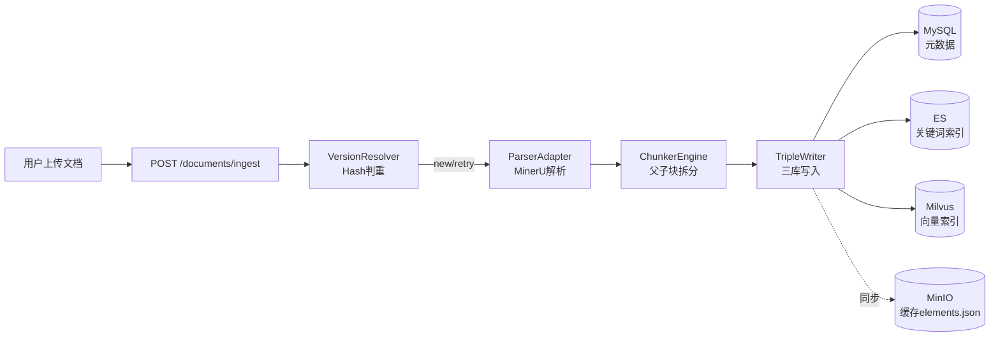
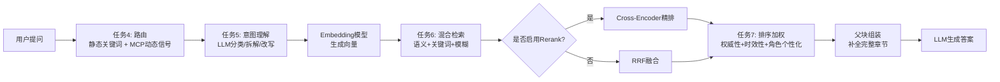
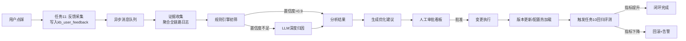
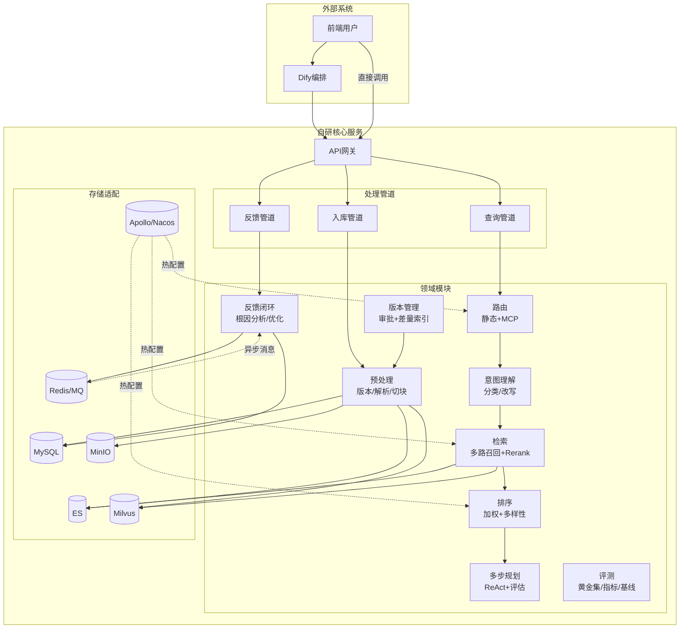

基于您提供的全部设计文档（数据模型、外部API、内部接口契约），我为您绘制了**系统整体分层架构图**，并附上深度分析。

---

## 一、系统整体分层架构图

```mermaid
graph TB
    %% ==================== 样式定义 ====================
    classDef external fill:#E3F2FD,stroke:#1565C0,stroke-width:2px;
    classDef app fill:#E8F5E9,stroke:#2E7D32,stroke-width:2px;
    classDef domain fill:#FFF3E0,stroke:#E65100,stroke-width:2px;
    classDef infra fill:#F3E5F5,stroke:#6A1B9A,stroke-width:2px;
    classDef offline fill:#FCE4EC,stroke:#880E4F,stroke-width:2px;
    classDef storage fill:#ECEFF1,stroke:#455A64,stroke-width:2px;

    %% ==================== 1. 接入与编排层 ====================
    subgraph L1_Orchestration[接入与编排层]
        direction TB
        Dify[Dify 工作流引擎<br/>（路由/检索/LLM节点编排）]
        API_Gateway[自研 API 网关<br/>（40+ 外部RESTful接口）]
    end
    class L1_Orchestration external;

    %% ==================== 2. 应用层 ====================
    subgraph L2_Application[应用层 —— 编排器（Application Services）]
        direction LR
        IO[IngestionOrchestrator<br/>入库调度器]
        RS[RouterService<br/>路由服务]
        QU[QueryUnderstandingService<br/>意图理解服务]
        SO[SearchOrchestrator<br/>召回编排器]
        RankS[RankingService<br/>排序服务]
        AO[AgentOrchestrator<br/>多步规划编排器]
        FC[FeedbackCollector<br/>反馈采集服务]
        AnO[AnalysisOrchestrator<br/>根因分析编排器]
        OM[OptimizationManager<br/>优化建议管理器]
        Runner[Runner<br/>评测运行器]
    end
    class L2_Application app;

    %% ==================== 3. 领域层 ====================
    subgraph L3_Domain[领域层 —— 核心接口（Domain Interfaces）]
        direction TB
        
        subgraph Domain_Preprocess[预处理领域]
            VR[VersionResolver<br/>版本解析]
            PA[ParserAdapter<br/>MinerU适配器]
            CE[ChunkerEngine<br/>切块引擎]
            TW[TripleWriter<br/>三库写入器]
        end
        
        subgraph Domain_Search[检索排序领域]
            RM[IRouterMatcher<br/>路由匹配引擎]
            MCP[IMetadataMCPClient<br/>MCP动态信号客户端]
            IC[IIntentClassifier<br/>意图分类器]
            QR[IQueryRewriter<br/>查询改写器]
            HS[IHybridSearcher<br/>多路召回器]
            Rerank[IRerankClient<br/>Rerank精排客户端]
            Rank[IRanker<br/>排序加权引擎]
        end
        
        subgraph Domain_Govern[治理与闭环领域]
            VD[IVersionDetector<br/>版本检测器]
            AW[IApprovalWorkflow<br/>审批工作流]
            DI[IDeltaIndexer<br/>差量索引器]
            Eval[IEvaluator<br/>自主评估器]
            EC[IEvidenceCollector<br/>证据收集器]
            RCA[RootCauseAnalyzer<br/>根因分析器]
        end
        
        subgraph Domain_Offline[离线评测领域]
            GSM[IGoldenSetManager<br/>黄金集管理]
            IRun[IRunner<br/>评测执行]
            ICalc[IMetricsCalculator<br/>指标计算]
            IBL[IBaselineManager<br/>基线管理]
        end
    end
    class L3_Domain domain;

    %% ==================== 4. 基础设施层 ====================
    subgraph L4_Infrastructure[基础设施层]
        direction TB
        
        subgraph Infra_Storage[存储组件]
            MySQL[(MySQL 8.0<br/>元数据/日志/配置)]
            ES[(Elasticsearch<br/>关键词检索 + 过滤)]
            Milvus[(Milvus<br/>向量检索 + 标量过滤)]
            MinIO[(MinIO<br/>原始文件/解析缓存)]
        end
        
        subgraph Infra_Config[配置与协调]
            Apollo[Apollo/Nacos<br/>热配置中心]
            MQ[RabbitMQ/Pulsar<br/>消息队列]
            Redis[(Redis<br/>MCP缓存/会话)]
        end
        
        subgraph Infra_Adapter[外部适配器]
            MinerU[MinerU 解析引擎]
            DifyClient[Dify API Client<br/>（信息同步/鉴权）]
            Cohere[Cohere / BGE<br/>Rerank Client]
            MCPClient[MCP 元数据服务<br/>HTTP Client]
        end
    end
    class L4_Infrastructure infra;

    %% ==================== 5. 离线与治理层 ====================
    subgraph L5_Offline[离线与治理层]
        Git[(Git 仓库<br/>黄金问答集/评测脚本)]
        CI[CI/CD 制品库<br/>评测结果/基线快照]
        Monitor[Grafana/Prometheus<br/>监控告警面板]
    end
    class L5_Offline offline;

    %% ==================== 核心数据流连接 ====================
    %% 外部 -> 应用层
    API_Gateway --> IO & RS & QU & SO & RankS & AO & FC & Runner
    Dify -.->|HTTP调用| API_Gateway

    %% 应用层 -> 领域层
    IO --> VR & PA & CE & TW
    RS --> RM & MCP
    QU --> IC & QR
    SO --> HS & Rerank
    RankS --> Rank
    AO --> Eval
    FC --> EC
    AnO --> RCA
    OM --> AW & DI
    Runner --> GSM & IRun & ICalc & IBL

    %% 领域层 -> 基础设施层
    PA --> MinerU
    TW --> MySQL & ES & Milvus
    HS --> ES & Milvus
    Rerank --> Cohere
    MCP --> MCPClient
    IRun -.->|调用外部API| API_Gateway
    DI --> TW

    %% 基础设施层内部存储依赖
    Apollo -.->|配置注入| RS & QU & Rank & MCP
    MQ -.->|异步事件| FC & AnO
    MySQL --> TW & DI & EC
    ES --> HS & DI
    Milvus --> HS & DI

    %% 离线层关联
    GSM -.->|读写| Git
    IRun -.->|产出| CI
    Monitor -.->|采集| MySQL

    %% ==================== 图例与标注 ====================
    subgraph Legend[图例说明]
        L1[🟦 接入与编排层]:::external
        L2[🟩 应用层]:::app
        L3[🟧 领域层]:::domain
        L4[🟪 基础设施层]:::infra
        L5[🟥 离线与治理层]:::offline
    end
```

---

## 二、核心数据流分析

### 2.1 写入链路（文档入库）

**关键设计点**：
- 父块仅存 MySQL，**不进入 ES/Milvus**，通过 `chunk_type=CHILD` 强制检索过滤
- 三库写入顺序：MySQL → ES → Milvus，任意一步失败均置 `status=2`，由补偿任务重试
- 版本升级时通过 `chunk_hash` 比对，仅对差异块执行增量更新

### 2.2 读取链路（查询问答）

**关键设计点**：
- MCP动态信号层在路由阶段注入实时业务上下文（风险等级、监管动态），使路由决策具备**实时感知能力**
- Rerank模型在任务6内部作为**可选步骤**，通过Nacos一键开关，对下游任务7完全透明
- `trace_id` 贯穿全部节点，支撑端到端问题定位

### 2.3 治理闭环链路（反馈驱动优化）

**关键设计点**：
- **三层漏斗分析**：规则初筛（低成本）→ LLM深度归因（高准确）→ 人工复核（低置信度）
- 优化建议类型涵盖：配置调优（Nacos）、文档重索引（任务8）、路由规则更新（任务4）
- 验证环节自动对接任务10，形成**数据驱动的持续优化飞轮**

## 三、架构设计核心优势（评审重点）

| 优势维度 | 设计体现 |
| :--- | :--- |
| **存储隔离** | MySQL管元数据、ES管关键词检索、Milvus管向量检索，各司其职，互不干扰 |
| **父子块结构** | 子块（~256 tokens）用于检索，父块（完整章节）用于返回，检索精度与上下文完整性兼得 |
| **父子块过滤加固** | ES映射 + Milvus标量字段均强制 `chunk_type == "CHILD"`，杜绝父块污染召回结果 |
| **依赖倒置（DIP）** | 全部内部接口通过Python ABC定义，实现类可随时替换（如MinerU→自研OCR，Cohere→BGE） |
| **MCP动态信号层** | 路由从"静态关键词匹配"升级为"实时上下文感知"，决策可解释（`mcp_enhanced` + `mcp_hint`） |
| **Rerank可插拔** | 通过Nacos一键开启/关闭，对上下游完全透明，支持A/B测试 |
| **增量索引** | 版本升级时仅增删改差异块（基于 `chunk_hash`），避免全量重建 |
| **异步非阻塞** | 日志写入、反馈分析、评测运行全部通过MQ/异步队列解耦，不阻塞主流程 |
| **全链路可观测** | `trace_id`贯穿全部21张日志表，支持端到端问题定位 |
| **离线评测独立** | 黄金问答集、评测结果、基线全部文件化存储，与业务数据库零耦合，天然CI/CD集成 |

## 四、关键组件交互关系总览

## 五、架构分层职责速查表

| 层级 | 核心职责 | 关键组件/模块 |
| :--- | :--- | :--- |
| **接入与编排层** | 对外暴露RESTful API，接收Dify编排请求 | Dify工作流、自研API网关（40+接口） |
| **应用层（编排器）** | 编排业务用例，协调领域模块，管理事务边界 | `IngestionOrchestrator`, `RouterService`, `SearchOrchestrator`, `AgentOrchestrator`, `AnalysisOrchestrator` 等9个编排器 |
| **领域层（核心接口）** | 定义业务规则与核心算法，通过ABC抽象隔离技术实现 | 40+个Python抽象接口（`IVersionResolver`, `IHybridSearcher`, `IRerankClient`, `IEvaluator` 等） |
| **基础设施层** | 数据库访问、外部服务调用、配置管理、消息队列 | MySQL/ES/Milvus/MinIO客户端、Apollo/Nacos、MQ、MinerU/Dify/Cohere适配器 |
| **离线与治理层** | 黄金问答集管理、评测流水线、基线管理、监控告警 | Git仓库、CI制品库、Grafana/Prometheus |

> **总结**：本架构采用 **“Dify做轻量编排 + 自研做重型核心”** 的混合模式，通过**严格的分层**与**面向接口编程**实现了业务逻辑与技术实现的彻底解耦。存储层采用**三库分离** + **父子块结构**兼顾检索精度与上下文完整性，治理层通过 **MCP动态信号**、**Rerank可插拔** 和 **反馈闭环** 形成了持续演进的数据飞轮。该架构设计已达到**可直接进入开发实施**的成熟度。